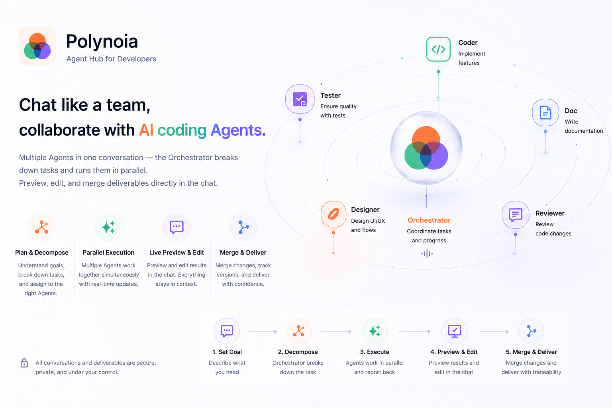
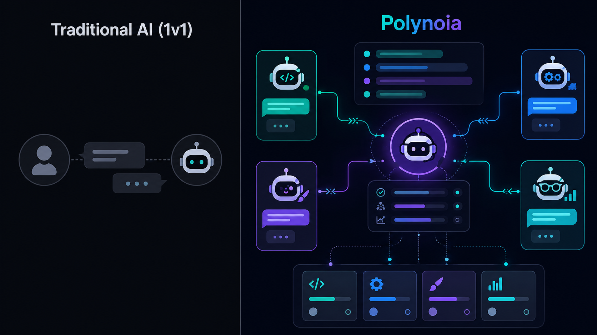
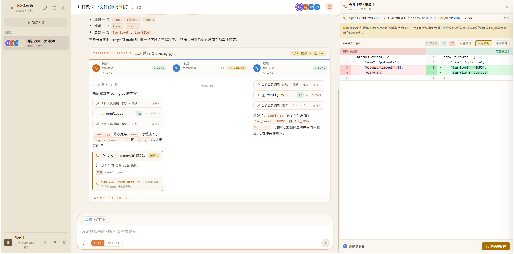

<p align="center">
  
</p>

<h1 align="center">Polynoia <sub><sup>(AgentHub)</sup></sub></h1>

<p align="center">
  <strong>Chat with a whole team of AI coding agents — like it's a group IM.</strong><br/>
  One conversation, many agents. An orchestrator splits the work, they build in parallel,
  and every result — code, diffs, docs, slides, web apps — is previewable, editable and
  mergeable right inside the chat.
</p>

<p align="center">
  <a href="README.md">English</a> ·
  <a href="README.zh-CN.md">简体中文</a>
</p>

<p align="center">
  
  
  
  
  
  
  
</p>

<!-- HERO SHOT — replace with a real screenshot of a group chat: an orchestrator
     dispatching sub-tasks in parallel, with an inline diff / preview open. -->
<p align="center">
  
</p>

---

## Table of contents

- [What is Polynoia?](#what-is-polynoia)
- [Why it's different](#why-its-different)
- [Screenshots](#screenshots)
- [Feature tour](#feature-tour)
  - [IM core](#-im-core)
  - [The Orchestrator](#-the-orchestrator-multi-agent-teamwork)
  - [Unified adapter layer](#-unified-adapter-layer)
  - [Custom agents](#-custom-agents)
  - [Inline artifacts](#-inline-artifacts)
  - [Workspace IDE](#-workspace-ide)
  - [Conflict closed-loop](#-conflict-closed-loop)
  - [Streaming & refresh-safe](#-streaming--refresh-safe)
  - [Cross-platform: web · desktop · mobile](#-cross-platform-web--desktop--mobile)
  - [Sandbox & security](#-sandbox--security)
- [Quick start](#quick-start)
- [Architecture](#architecture)
- [Tech stack](#tech-stack)
- [Project layout](#project-layout)
- [Docs & decisions](#docs--decisions)
- [Built with AI](#built-with-ai)

---

## What is Polynoia?

**Polynoia** (internal codename **AgentHub**) is an **IM-style multi-agent collaboration
platform**. You talk to AI coding agents — **Claude Code, Codex, OpenCode** — the same way
you'd use Slack / Lark / WeChat: start a chat, send a message, get rich results back.

- **1:1 chats** — pin a single, well-scoped task to one agent.
- **Group chats** — `@`-mention several agents; a designated **Orchestrator** decomposes the
  task, dispatches sub-tasks **in parallel**, then verifies and merges the outputs.
- **Inline artifacts** — replies aren't walls of text: code diffs, web previews, documents,
  slides, spreadsheets, data tables and commit history all render — and stay editable — in
  the conversation.
- **Bring your own agents** — Claude Code / Codex / OpenCode sit behind one protocol, and you
  can author custom agents (system prompt + tool set + capability tags) — even **from a
  one-line description**.

<p align="center">
  
</p>

> Each agent works in its **own sandboxed git worktree**. The Orchestrator merges branches
> into the workspace `main` and surfaces conflicts as a guided, side-by-side resolve UI.
> Dependencies stay **local to the working directory** (Python via `uv`, Node via local
> `node_modules`) — no global pollution.

## Why it's different

|  | Typical AI coding tool | **Polynoia** |
|---|---|---|
| Mental model | One assistant, one thread | **A team you chat with** — 1:1 and group |
| Parallelism | Sequential turns | **Orchestrator fans out** sub-tasks concurrently |
| Output | Text + code blocks | **12+ rich artifact types**, previewable & editable |
| Multiple engines | Locked to one vendor | **Claude Code · Codex · OpenCode** under one adapter layer |
| Merging work | Manual copy-paste | **Per-agent git worktrees** + guided conflict resolution |
| Reach | Desktop browser | **Web · desktop (Tauri) · mobile (Capacitor)** from one codebase |

---

## Screenshots

| Group chat & orchestration | Inline artifact preview |
|---|---|
|  |  |
| **Workspace IDE** | **Conflict resolution** |
|  |  |

---

## Feature tour

### 💬 IM core

A chat client built for working *with* agents, not just prompting one.

- **Conversation list** with pin · archive · full-text search across titles and message bodies.
- **1:1 and group** conversations; per-member **role assignment** inside a group.
- **`@`-mention picker** (fuzzy, Slack/Linear-style) to summon specific agents.
- **Reply / quote / copy / retry**, and **"rewind to here"** code checkpoints to branch a
  conversation from any earlier message.
- **⌘K command palette** for instant search and navigation.

### 🧠 The Orchestrator (multi-agent teamwork)

The Orchestrator **is an agent** (`role="orchestrator"`), not special-cased code — so you can
swap profiles, add it to any group, or run without one.

- **Automatic task decomposition** → parallel dispatch to member agents.
- **Burst lanes** — concurrent agent work is shown as parallel lanes, never interleaved into
  an unreadable stream.
- **Verify & merge** — collects sub-task outputs, validates them, and merges branches into
  `main`.
- **Failure fallback** and **multi-agent merge-conflict resolution** built in.

### 🔌 Unified adapter layer

One protocol, multiple engines — add a new CLI agent without touching the core.

| Adapter | Wire protocol | Notes |
|---|---|---|
| **Claude Code** | Claude Agent SDK | strong reasoning, long context |
| **OpenCode** | Agent Client Protocol (ACP v1, JSON-RPC/NDJSON) | open standard, local-first |
| **Codex** | `codex` app-server streaming | backend set via `~/.codex/config.toml` |

Per-adapter **network proxy**, **credential auto-reuse** (uses your existing CLI logins — no
extra API keys), and a clean split between *adapters* (the engine) and *contacts* (a
configured persona on top of an engine).

### 🤖 Custom agents

Contacts are `(adapter, model, name, persona, tools)` — one engine can spawn many roles.

- **Role presets** + **granular tool toggles** (`read_file` / `edit_file` / `run_shell` /
  `network` / `call_agent` …).
- **Derived capability tags** so a group reads at a glance.
- **Conversational creation** — describe what you want ("a designer who writes React but can't
  run shell commands") and Polynoia drafts the agent for you to review.

### 📄 Inline artifacts

The frontend renders each message as `parts: MessagePart[]` dispatched through a
**registry** — a single reply can mix text + a diff + a live status strip. Part kinds include:

`text` · `reasoning` · `tasks` · `diff` · `web` · `metrics` · `sql` · `schema` · `logs` ·
`api` · `swatches` · `copy` · `file` · `image` · `ask-form` · `typing`

Plus rich **read-only / editable previews** for `.md` (WYSIWYG), **Marp** slides, `.html`,
**editable `.xlsx`**, `.docx` / `.pptx`, images, source code, and **live web previews** of the
app an agent just built.

### 🖥️ Workspace IDE

When a chat is backed by a project workspace you get a full mini-IDE in the right rail:

- **File tree** + **CodeMirror 6** editor (search/replace, VS Code keymap, minimap), with
  `Ctrl+S → PUT → auto-commit`.
- **Interactive PTY terminal** docked in the panel.
- **GitHub-style commit-history browser** with side-by-side diffs.
- Resizable, persisted panels.

### 🌿 Conflict closed-loop

Parallel agents on separate branches *will* collide. Polynoia turns that into a first-class,
guided flow: conflicts surface as a card in the chat, open a **side-by-side resolve pane**,
and the resolution is committed back to `main` — with the whole loop explained in plain
language (no raw git hashes in your face).

### 🌊 Streaming & refresh-safe

- **AI SDK 6 `UIMessageChunk` protocol** over WebSocket (28 chunk types + custom `data-*`).
- **Refresh-safe streaming** — reconnect mid-generation and the thinking/reply stream picks
  right back up where it left off.

### 📱 Cross-platform: web · desktop · mobile

One Vite build, three runtimes — **not** three rewrites.

- **Web** — the full experience in any modern browser.
- **Desktop** — **Tauri 2** wraps the web build with native window chrome.
- **Mobile** — **Capacitor 6** wraps the *same* build: a WeChat-style 4-tab home
  (Chats · Agents · Projects · Me) with a lightweight, read-only-preview IM subset tuned for
  touch.

### 🔒 Sandbox & security

- Each agent subprocess runs in `~/sandbox/<conv-id>/` with `cwd` pinned and a restricted env.
- **Tool whitelist** and **network allow-list** (LLM endpoint + npm + pypi).
- Per-agent **git worktrees** keep work isolated until an explicit merge.

---

## Quick start

### Prerequisites (one-time)

| Tool | Requirement | Install |
|---|---|---|
| Python | 3.12+ | system package manager |
| Node | 22+ | nvm / system package |
| uv | latest | `curl -LsSf https://astral.sh/uv/install.sh \| sh` |
| Claude Code CLI | logged in | `npm i -g @anthropic-ai/claude-code`, then `claude` to log in |
| Codex CLI _(optional)_ | configured | `npm i -g @openai/codex`; backend via `~/.codex/config.toml` |
| OpenCode CLI _(optional)_ | — | `npm i -g opencode-ai`, then `opencode auth login` |
| pnpm | 9.x | **`make install` pulls it via corepack automatically** |

### Install & run

```bash
make install      # uv sync (server) + pnpm install (web)
make dev          # server :7780 + web :5173  (Ctrl-C stops both)
```

Open **http://127.0.0.1:5173/** (API at http://127.0.0.1:7780/).

### Seed a demo (recommended)

With `make dev` running, in a second terminal:

```bash
python3 scripts/seed_demo.py            # personas + a workspace + a group chat
```

Or load **scenario test cases** — each builds its own workspace and documents what to send and
what to expect:

```bash
python3 scripts/scenarios/seed_all.py   # office docs · web game · fullstack · data · conflict drill · manual review
```

### Handy commands

```bash
make server   # backend only (logs)
make web      # frontend only
make test     # pytest + vitest
make lint     # ruff + biome
make types    # regenerate shared TS types from Pydantic
```

---

## Architecture

```
apps/
├── web/          Vite + React + TypeScript — the UI shell (reused by all 3 platforms)
├── server/       Python 3.12 + FastAPI + asyncio (uv-managed)
├── desktop/      Tauri 2 wrapper around apps/web/dist
└── mobile/       Capacitor 6 wrapper around apps/web/dist

docs/
├── research/          deep-dive on 20 libraries + UI design (baseline)
├── superpowers/specs/ full design spec
├── ADR/               21 architecture decision records
└── design/            conflict closed-loop charter + diagrams
```

**Three protocol layers:**

| Hop | Protocol |
|---|---|
| Adapter ↔ Server | **PAP** — NDJSON over stdin/stdout (Claude Agent SDK) |
| Server ↔ Client | **AI SDK 6** `UIMessageChunk` over SSE/WS (28 chunk types + `data-*`) |
| Client → Server | REST + WS commands |

The frontend dispatches messages through a **MessagePart registry**, so one message can carry
text + diff + status parts together. See the
[design spec](docs/superpowers/specs/2026-05-23-polynoia-design.md) and the
[context-system overview](docs/context-system.html) for the full model.

## Tech stack

- **Backend** · Python 3.12 · uv · FastAPI · Pydantic v2 · LiteLLM · SQLite (→ Postgres) · Alembic
- **Frontend** · React 18 + Vite · Radix + shadcn/ui · Tailwind 4 · Motion · Lucide · CodeMirror 6 · `@git-diff-view/react` · Vercel AI SDK 6 · react-markdown
- **Shells** · Tauri 2 (desktop) · Capacitor 6 (mobile)

## Project layout

```
polynoia/
├── apps/            web (Vite+React) · server (FastAPI) · desktop (Tauri) · mobile (Capacitor)
├── packages/        shared TS types · cross-platform core · ui-web · design-tokens
├── docs/            research · specs · ADRs · diagrams
├── scripts/         demo + scenario seeders
├── .skills/         custom skills (add-adapter / add-card-type / …)
└── Makefile         make dev / test / lint / types / build
```

## Docs & decisions

- **Design spec** — [`docs/superpowers/specs/2026-05-23-polynoia-design.md`](docs/superpowers/specs/2026-05-23-polynoia-design.md)
- **Research synthesis** (20 libraries) — [`docs/research/00-SYNTHESIS.md`](docs/research/00-SYNTHESIS.md)
- **Architecture decisions** — [`docs/ADR/`](docs/ADR/) (why the orchestrator is an agent, ACP
  over stdout JSON, CodeMirror over Monaco, Capacitor over React Native, …)

## Built with AI

This project is built **with** AI as a first-class collaborator. The conventions live in
[`CLAUDE.md`](CLAUDE.md); decisions are recorded in [`docs/ADR/`](docs/ADR/) and research in
[`docs/research/`](docs/research/). Commits follow
[Conventional Commits](https://www.conventionalcommits.org/).

---

<p align="center"><sub>Polynoia — many minds, one conversation.</sub></p>
