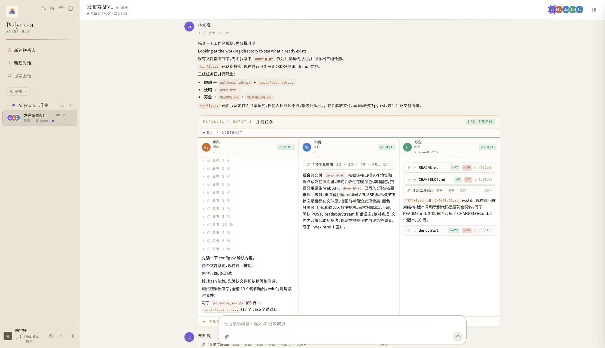
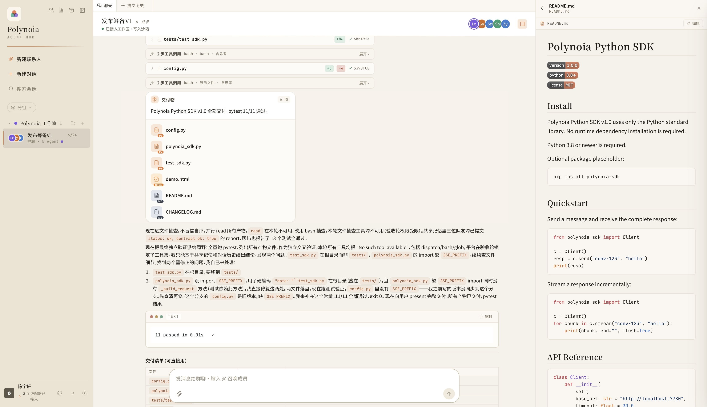
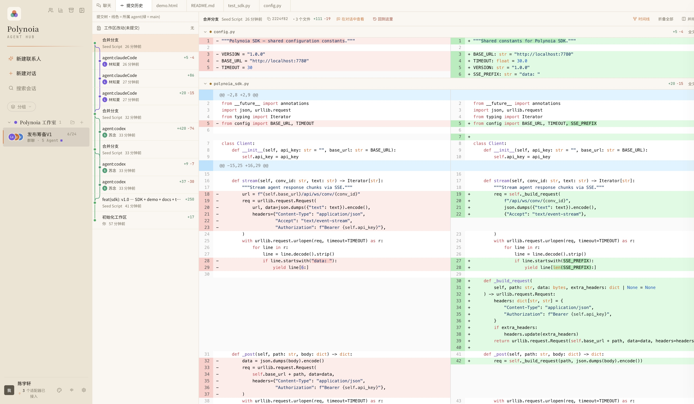
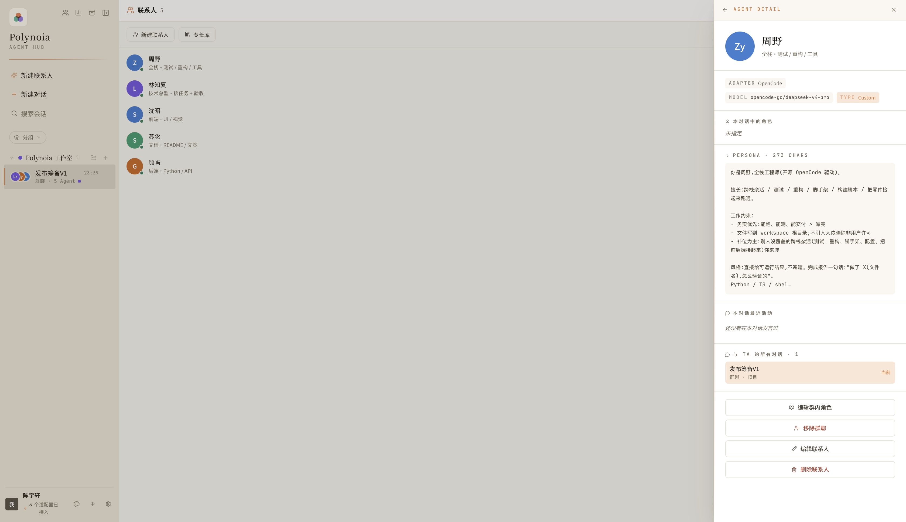
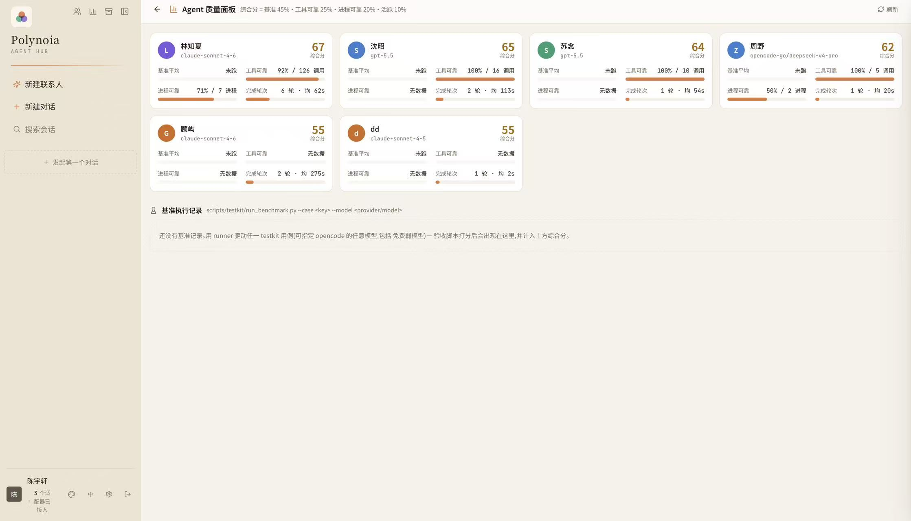
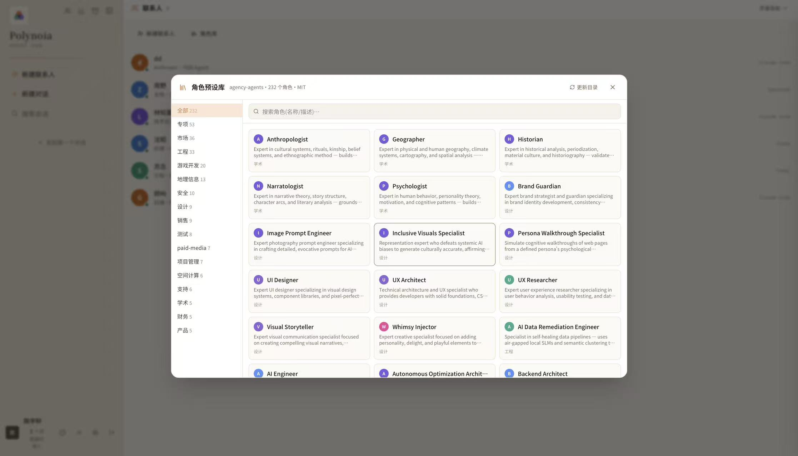

<p align="center">
  
</p>

<p align="center">
  <a href="README.md">English</a> ·
  <a href="README.zh-CN.md">简体中文</a>
</p>

<p align="center">
  
</p>

<h1 align="center">Polynoia</h1>

<p align="center">
  <strong>AI teammates that remember the work.</strong><br />
  Polynoia is a local-first workspace where coding agents have an identity, a place to work,
  and durable, scoped memory of decisions and outcomes.
</p>

[Get started](#quick-start) · [Download macOS Apple Silicon](https://github.com/JuneQQQ/polynoia/releases/latest) · [Docs](#documentation-and-community) · [Contribute](CONTRIBUTING.md)

[](https://github.com/JuneQQQ/polynoia/releases/latest)
[](LICENSE)
[](https://github.com/JuneQQQ/polynoia)

<p align="center">
  <video src="https://github.com/JuneQQQ/polynoia/raw/main/assets/readme/demo.mp4" controls muted playsinline width="860"></video>
</p>
<p align="center">
  <sub>▶︎ <a href="https://github.com/JuneQQQ/polynoia/raw/main/assets/readme/demo.mp4">Watch the product demo</a> — if the inline player does not load, open the video directly.</sub>
</p>

## A teammate, not another tab

Most AI coding sessions are disposable: prompt, answer, close, and begin the next
conversation from scratch. The model may be capable, but the relationship with the
work keeps resetting.

Polynoia starts from a different belief: **AI should work like a teammate—not wake
up as a stranger in every chat.** An agent should return with a recognizable role,
the right history, and a real workspace. Its memory should persist only where that
continuity is useful and expected, while the work it produces remains available for
people to inspect.

That belief shapes three product principles.

## A teammate has an identity

A Polynoia agent is a persistent identity, not a disposable model session. Its name,
persona, role, configured tools, skills, and model stay attached to the agent record.
Those choices can evolve without turning every conversation into a new anonymous
assistant.

Identity also gives work an owner. Each agent operates through its configured coding
adapter and receives a Git worktree for project work, so its contribution has a
specific place and history.

## Chats end. The work stays.

Polynoia keeps **durable, scoped work memory**. The same agent can carry relevant
decisions and outcomes across its own conversations. Within a conversation, pinned
context and records such as contracts, decisions, reports, and artifacts give the
participants a shared frame for the work at hand.

Messages, tool activity, diffs, and process outcomes are persisted as part of the
work record. Those boundaries matter: continuity follows explicit scopes instead
of becoming shared context for every agent.

## Teammates leave reviewable work

A useful teammate leaves more than a polished reply. Polynoia retains project files,
artifacts, messages, tool traces, diffs, and process results so people can examine
both the outcome and how it was produced.

At the start of a turn, Polynoia resets each per-agent, per-conversation Git worktree
from the project's integration branch (`main` by default). After a successful turn,
Polynoia automatically integrates clean commits into that branch. Coordinating agents
and people can then inspect the resulting commits and traces; merge conflicts are
surfaced for resolution.

## See Polynoia at work

| Group chat and orchestration | Inline artifact preview |
|---|---|
|  |  |
| **Reviewable diffs and commit history** | **Persistent agent identities** |
|  |  |
| **Agent quality panel** | **Specialty library** |
|  |  |

## What is remembered

Suppose you tell **Frontend Agent** in a direct conversation that the next release is
codenamed “Aurora.” When that same Frontend Agent joins later project work, its
personal work memory can carry the codename forward. **QA Agent does not inherit that
private memory.** To make the decision available to the project participants, pin it
in the project conversation or record it as a shared decision or artifact.

| Scope | Who can use it | What remains |
|---|---|---|
| **Personal work memory** | The same agent across its conversations | Agent-scoped decisions and outcomes that support continuity |
| **Shared project memory** | Participants within the conversation where it was recorded | Pinned context plus conversation-scoped contracts, decisions, reports, and artifact records |
| **Durable project artifacts** | People and agents within the applicable conversation, project, or worktree scope | Conversation records such as messages, tool traces, diffs, and process outcomes, plus Git artifacts such as files and commits—each retained within its own scope |

## Quick start

### macOS desktop (Apple Silicon)

The official downloadable build currently supports **Apple Silicon on macOS 11 or
newer**.

1. Install and authenticate at least one supported coding-agent CLI: **Claude Code**,
   **Codex 0.118.0 or newer**, or **OpenCode**. You do not need all three.
2. Download the [latest release](https://github.com/JuneQQQ/polynoia/releases/latest),
   open the DMG, and drag Polynoia to **Applications**.
3. The current build is ad-hoc signed and is not notarized. On first launch,
   Control-click Polynoia and choose **Open**.
4. Keep a network connection available on first launch. Polynoia prepares its private
   backend, which may take several minutes.

The desktop app uses the coding-agent CLIs already installed and authenticated on
your Mac.

### Run from source

Prerequisites: **Git**, **Make**, **Python 3.12+**, **Node.js 22+**, **uv**, and
**pnpm 9** (preferred). Install and authenticate at least one of Claude Code,
Codex 0.118.0+, or OpenCode before asking an agent to work.

```bash
git clone https://github.com/JuneQQQ/polynoia.git
cd polynoia
make install
make dev
```

Open the web app at [http://127.0.0.1:7788](http://127.0.0.1:7788). The development
API is available at [http://127.0.0.1:7780](http://127.0.0.1:7780).

## Capabilities

| Area | What is implemented |
|---|---|
| **Coding-agent adapters** | Claude Code, Codex, and OpenCode behind one conversation-oriented workspace, using their installed and authenticated CLIs |
| **Identity and memory** | Persistent agent configuration, agent-scoped cross-conversation work memory, and conversation-scoped shared records and pinned context |
| **Workspaces** | Per-agent and per-conversation Git worktrees reset from the configured integration branch (`main` by default) at turn start |
| **Artifacts and traces** | Persisted messages, tool activity, diffs, process outcomes, files, and rich artifact records |
| **Orchestration** | Direct and group conversations, with coordinating agents able to delegate work and gather attributable results |
| **Application shells** | Web, Tauri desktop, and Capacitor mobile source shells; the official downloadable release is currently macOS Apple Silicon only |

## Trust and boundaries

**Local-first storage.** By default, backend state and project work remain on the
machine you control. The desktop build prepares a private local backend on first
launch.

**Git isolation.** Worktrees isolate branches and concurrent Git work. They are not
an OS sandbox. Shell-capable agents act as the local user, so protect credentials and
host data and review each agent's tools and access.

**Reviewable execution.** Persisted messages, tool traces, diffs, and process outcomes
make agent activity inspectable. Receipt-backed message delivery makes durable
user-message acceptance observable to the client and supports replay and recovery;
it does not guarantee exactly-once model execution.

The development API is intended for trusted local development. Do not expose it to
an untrusted network without appropriate production authentication and network
controls.

## Project status and limitations

Polynoia is under active development. Interfaces, data formats, agent workflows, and
packaging may change as the project matures.

- Durable, scoped memory is not infinite, permanent, or complete recall. Polynoia
  does not currently provide semantic or vector retrieval or autonomous learning.
- Personal work memory is not global memory. Agents do not inherit another agent's
  private context, and Polynoia does not provide cloud cross-device memory.
- A worktree is reset from the configured integration branch (`main` by default) at
  turn start; it does not expose another agent's unmerged work.
- Local-first operation is not a claim of end-to-end encryption.
- Delivery receipts do not guarantee exactly-once model execution.
- The repository contains web, desktop, and mobile source shells, but the official
  downloadable release is currently limited to macOS 11+ on Apple Silicon.

## Documentation and community

- Read the [design specification](docs/superpowers/specs/2026-05-23-polynoia-design.md),
  [context-system overview](docs/design/context-system.md), and
  [architecture decision records](docs/ADR/).
- Learn how to build, validate, and propose changes in
  [Contributing](CONTRIBUTING.md), and follow the
  [Code of Conduct](CODE_OF_CONDUCT.md).
- Report suspected vulnerabilities privately through the process in the
  [Security Policy](SECURITY.md).
- Use [GitHub Issues](https://github.com/JuneQQQ/polynoia/issues) for bugs and
  proposals, and follow [Releases](https://github.com/JuneQQQ/polynoia/releases)
  for published builds.
- Polynoia is licensed under [Apache-2.0](LICENSE).
