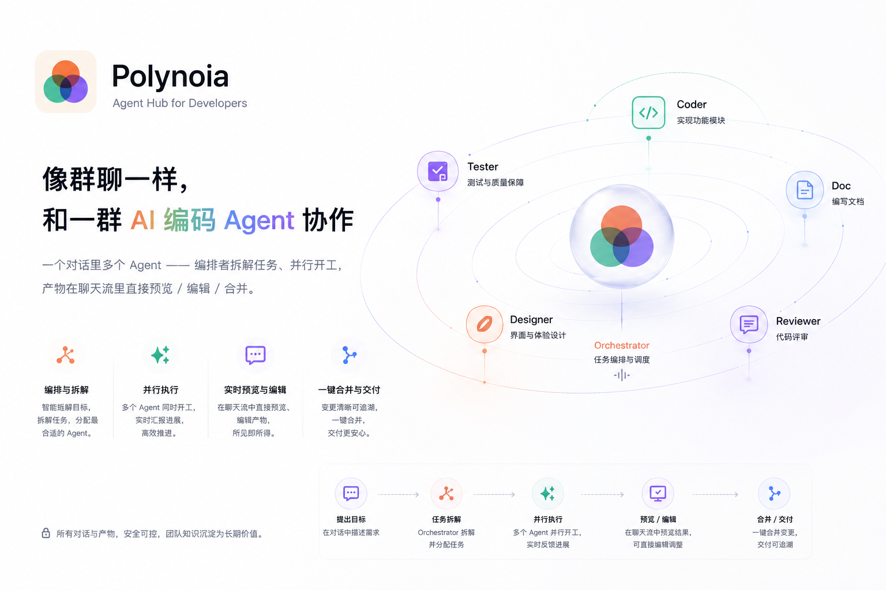

<p align="center">
  
</p>

<h1 align="center">Polynoia <sub><sup>(AgentHub)</sup></sub></h1>

<p align="center">
  <strong>一个通过聊天协作构建软件的开源多 Agent 工作区。</strong><br/>
  在同一个 IM 界面中协调 Claude Code、Codex、OpenCode 和自定义 Agent,
  内联查看产物、预览工作区、追踪提交历史并完成合并。
</p>

<p align="center">
  <a href="README.md">English</a> ·
  <a href="README.zh-CN.md">简体中文</a>
</p>

<p align="center">
  
  
  
  
  
  
  
</p>

<!-- 主图 — 换成真实截图:群聊里编排者并行派活、同时打开一个内联 diff/预览 -->
<p align="center">
  
</p>

<!-- 产品演示视频 —— 经 Git LFS 提交;GitHub 从 raw 链接内联渲染播放器 -->
<p align="center">
  <video src="https://github.com/JuneQQQ/polynoia/raw/main/assets/readme/demo.mp4" controls muted playsinline width="860"></video>
</p>
<p align="center">
  <sub>▶︎ <a href="https://github.com/JuneQQQ/polynoia/raw/main/assets/readme/demo.mp4">观看产品演示视频</a> —— 如果内联播放器没加载,点这里播放。</sub>
</p>

---

## 目录

- [Polynoia 是什么?](#polynoia-是什么)
- [和传统工具有何不同](#和传统工具有何不同)
- [截图](#截图)
- [功能详览](#功能详览)
  - [IM 核心](#-im-核心)
  - [编排者(多 Agent 协作)](#-编排者多-agent-协作)
  - [统一适配器层](#-统一适配器层)
  - [自定义 Agent](#-自定义-agent)
  - [内联产物](#-内联产物)
  - [工作区 IDE](#-工作区-ide)
  - [冲突闭环](#-冲突闭环)
  - [流式与刷新安全](#-流式与刷新安全)
  - [跨平台:web · 桌面 · 移动](#-跨平台web--桌面--移动)
  - [沙箱与安全](#-沙箱与安全)
- [快速开始](#快速开始)
- [架构](#架构)
- [技术栈](#技术栈)
- [仓库结构](#仓库结构)
- [文档与决策](#文档与决策)
- [与 AI 协作构建](#与-ai-协作构建)

---

## Polynoia 是什么?

Polynoia 是一个面向 Agentic Software Development 的 **IM 形态多 Agent 协作平台**。
它不把每个编码 Agent 隔离成一个终端会话,而是给它们一个共享工作区、聊天式协调层,
以及从想法 → 文件 → 预览 → 提交的可审查路径。

你像用 Slack / 飞书 / 微信一样和 AI 编码 Agent(Claude Code、Codex、OpenCode 或自定义
Agent)打交道:新建对话、发消息、拿回富媒体产物,然后在不离开聊天流的情况下检查和合并。

- **单聊** —— 把一个明确、聚焦的任务交给单个 Agent。
- **群聊** —— `@` 多个 Agent,由指定的**编排者(Orchestrator)** 拆解任务、**并行**派活,再验收并合并产物。
- **内联产物** —— 回复不再是大段文字:代码 diff、网页预览、文档、幻灯片、表格、数据表、提交历史,
  全部在对话里直接渲染,而且**可编辑**。
- **自带 Agent** —— Claude Code / Codex / OpenCode 走同一套协议;你也能自建 Agent
  (system prompt + 工具集 + 能力标签),甚至**一句话对话式创建**。

<p align="center">
  
</p>
> 每个 Agent 在自己**独立的沙箱 git worktree** 里干活;编排者把分支合进工作区 `main`,冲突会升起
> 一个引导式的并排解决界面。依赖**留在本地工作目录**(Python 用 `uv`,Node 用本地 `node_modules`)——
> 不污染全局。

## 和传统工具有何不同


|  | 常见 AI 编码工具 | **Polynoia** |
|---|---|---|
| 心智模型 | 一个助手、一条线程 | **一支能群聊的团队** —— 单聊 + 群聊 |
| 并行 | 顺序轮流 | **编排者并发派发**子任务 |
| 产出 | 文字 + 代码块 | **20+ 种富产物**,可预览可编辑 |
| 多引擎 | 锁定单一厂商 | **Claude Code · Codex · OpenCode** 统一适配层 |
| 合并成果 | 手动复制粘贴 | **每个 Agent 独立 git worktree** + 引导式冲突解决 |
| 触达 | 桌面浏览器 | **web · 桌面(Tauri) · 移动(Capacitor)** 同一份代码 |

---

## 截图

| 群聊与编排 | 内联产物预览 |
|---|---|
|  |  |
| **工作区 IDE** | **冲突解决** |
|  |  |

---

## 功能详览

### 💬 IM 核心

一个为「与 Agent 协作」而非「单纯提问」打造的聊天端。

- **会话列表**:置顶 · 归档 · 标题与正文全文搜索,每行标题下还有**微信/Slack 式最近消息预览**
  (按优先级:正在工作的 Agent → 未发送草稿 → 最近一条消息 → 工作区)。
- **单聊 + 群聊**;群内可给每个成员**指派角色**。
- **`@` 提及选择器**(模糊匹配,Slack/Linear 风格)召唤指定 Agent。
- **回复 / 引用 / 复制 / 重试**,以及**「回到这里」代码检查点** —— 从任意历史消息处岔开重来。
- **⌘K 命令面板**,即时搜索与跳转。

### 🧠 编排者(多 Agent 协作)

编排者**本身就是一个 Agent**(`role="orchestrator"`),不是特殊代码 —— 可换 profile、可加进任意群、也可不要。

- **自动拆解任务** → 并行派发给成员 Agent。
- **Burst 泳道** —— 并发的 Agent 工作以并行泳道呈现,不会交织成一团乱流。
- **验收并合并** —— 收集子任务产物、校验、把分支合进 `main`。
- 内置**失败降级**与**多 Agent 合并冲突解决**。

### 🔌 统一适配器层

一套协议、多个引擎 —— 加一个新 CLI Agent 不用动核心。

| 适配器 | 通信协议 | 说明 |
|---|---|---|
| **Claude Code** | Claude Agent SDK | 推理强、长上下文 |
| **OpenCode** | Agent Client Protocol(ACP v1,JSON-RPC/NDJSON) | 开放标准、本地优先 |
| **Codex** | `codex` app-server 流式 | backend 由 `~/.codex/config.toml` 指定 |

支持按适配器配**网络代理**、**凭证自动复用**(直接用你已登录的 CLI,无需额外 API key),
并清晰区分*适配器*(引擎)与*联系人*(引擎之上配置好的人设)。

### 🤖 自定义 Agent

联系人 = `(适配器, 模型, 名字, 人设, 工具)` —— 一个引擎能派生多种角色。

- **角色预设** + **工具细勾选**(`read_file` / `edit_file` / `run_shell` / `network` /
  `call_agent` …)。
- **自动推导能力标签**,群里一眼能看懂谁会什么。
- **对话式创建** —— 一句话描述需求(「一个会写 React、但不能跑 shell 命令的设计师」),
  Polynoia 帮你起草 Agent 供你确认。

### 📄 内联产物

前端把每条消息渲染成 `parts: MessagePart[]`,经**注册表**分派 —— 一条回复可同时含
文字 + diff + 实时状态条。已注册的 21 种 part 类型:

`text` · `reasoning` · `tasks` · `diff` · `web` · `swatches` · `copy` · `metrics` · `sql` ·
`schema` · `logs` · `terminal` · `api` · `typing` · `tool-call` · `ask-form` · `image` ·
`file` · `files` · `error` · `conflict`

外加对 `.md`(所见即所得)、**Marp** 幻灯片、`.html`、**可编辑 `.xlsx`**、`.docx` / `.pptx`、
图片、源代码的丰富**只读/可编辑预览**,以及 Agent 刚搭好的应用的**网页实时预览**。

### 🖥️ 工作区 IDE

当一个对话挂在项目工作区上时,右栏就是一个完整的迷你 IDE:

- **文件树** + **CodeMirror 6** 编辑器(查找替换、VS Code 键位、小地图),`Ctrl+S → PUT → 自动提交`。
- 面板内嵌**交互式 PTY 终端**。
- **GitHub 式提交历史**浏览,并排 diff。
- 面板可拖动、状态持久化。

### 🌿 冲突闭环

并行 Agent 在不同分支上*一定*会撞车。Polynoia 把它做成一等的引导流程:冲突在聊天里升起一张卡片 →
打开**并排解决面板** → 解决结果提交回 `main` —— 整个过程用人话讲清楚(不把 git 哈希怼到你脸上)。

### 🌊 流式与刷新安全

- **AI SDK 6 `UIMessageChunk` 协议**走 WebSocket(28 种 chunk + 自定义 `data-*`)。
- **刷新安全的流式** —— 生成途中重连,思考 / 回复的打印流从断点无缝接上。

### 📱 跨平台:web · 桌面 · 移动

同一份 Vite 构建,三种运行时 —— **不是**三套重写。

- **Web** —— 任意现代浏览器里的完整体验。
- **桌面** —— **Tauri 2** 包裹 web 构建,默认启动随机 localhost 端口的桌面私有内置后端,也可在设置中切换到自定义本机/局域网/远程后端。
- **移动** —— **Capacitor 6** 包裹*同一份*构建:微信式 4-tab 首页
  (消息 · 联系人 · 项目 · 我),为触屏精简的「轻量 IM + 只读产物预览」子集。

### 🔒 沙箱与安全

- 每个 Agent 子进程跑在 `~/sandbox/<conv-id>/`,`cwd` 锁定、env 受限。
- **工具白名单** + **网络白名单**(LLM 端点 + npm + pypi)。
- 每个 Agent 独立 **git worktree**,在显式合并前彼此隔离。

---

## 快速开始

### 前置(一次性)

| 工具 | 要求 | 装法 |
|---|---|---|
| Python | 3.12+ | 系统包管理器 |
| Node | 22+ | nvm / 系统包 |
| uv | 最新 | `curl -LsSf https://astral.sh/uv/install.sh \| sh` |
| Claude Code CLI | 已登录 | `npm i -g @anthropic-ai/claude-code`,再 `claude` 登录 |
| Codex CLI _(可选)_ | 已配置 | `npm i -g @openai/codex`;backend 由 `~/.codex/config.toml` 指定 |
| OpenCode CLI _(可选)_ | — | `npm i -g opencode-ai`,再 `opencode auth login` |
| pnpm | 9.x | **`make install` 会用 corepack 自动拉,无需手动** |

> 国内网络可设 npm 源:`npm config set registry https://registry.npmmirror.com`

### 安装并运行

```bash
make install      # uv sync(后端)+ pnpm install(前端)
make dev          # 后端 :7780 + 前端 :7788(Ctrl-C 全停)
```

打开 **http://127.0.0.1:7788/**(后端 API 在 http://127.0.0.1:7780/)。

### 灌一个演示(推荐)

`make dev` 跑着的同时,另开一个终端:

```bash
python3 scripts/seed_demo.py            # 几个人设 + 1 个工作区 + 1 个群聊
```

或灌入官方提交用的**上线准备 testkit**:

```bash
bash scripts/testkit/reset.sh # 清库 + 灌入上线 / @ 路由 / 合并 / diff 用例
```

这批用例覆盖 Release Notes、QA 检查表、状态页、埋点验收报告、Go-live 群聊协作、
@ 路由、冲突处理、main 同步、Diff/历史和工具错误恢复。

### 常用命令

```bash
make server   # 仅后端(看日志)
make web      # 仅前端
make test     # pytest + vitest
make lint     # ruff + biome
make types    # 由 Pydantic 重新生成共享 TS 类型
```

---

## 架构

```
apps/
├── web/          Vite + React + TypeScript —— UI 壳(三端复用同一份)
├── server/       Python 3.12 + FastAPI + asyncio(uv 管理)
├── desktop/      Tauri 2 外壳 + 桌面后端选择 / 内置 server resource
└── mobile/       Capacitor 6 包裹 apps/web/dist

docs/
├── research/          已有调研(20 个库 + UI 设计)
├── superpowers/specs/ 完整设计 spec
├── ADR/               23 篇架构决策记录
└── design/            冲突闭环 charter + 图示
```

**三层协议:**

完整模型见[设计 spec](docs/superpowers/specs/2026-05-23-polynoia-design.md) 与
[上下文构成系统](docs/design/context-system.md)。

## 技术栈

- **后端** · Python 3.12 · uv · FastAPI · Pydantic v2 · LiteLLM · SQLite(→ Postgres)· Alembic
- **前端** · React 18 + Vite · Radix + shadcn/ui · Tailwind 4 · Motion · Lucide · CodeMirror 6 · `@git-diff-view/react` · Vercel AI SDK 6 · react-markdown
- **外壳** · Tauri 2(桌面)· Capacitor 6(移动)

## 仓库结构

```
polynoia/
├── apps/            web(Vite+React)· server(FastAPI)· desktop(Tauri)· mobile(Capacitor)
├── packages/        共享 TS 类型 · 跨平台 core · ui-web · design-tokens
├── docs/            调研 · spec · ADR · 图示
├── scripts/         演示 + 场景 seeder
├── .skills/         自定义 skill(add-adapter / add-card-type / …)
└── Makefile         make dev / test / lint / types / build
```

## 文档与决策

- **设计 spec** —— [`docs/superpowers/specs/2026-05-23-polynoia-design.md`](docs/superpowers/specs/2026-05-23-polynoia-design.md)
- **调研综合**(20 个库)—— [`docs/research/00-SYNTHESIS.md`](docs/research/00-SYNTHESIS.md)
- **架构决策记录** —— [`docs/ADR/`](docs/ADR/)(为何编排者是一个 Agent、为何选 ACP 而非
  stdout JSON、为何选 CodeMirror 而非 Monaco、为何选 Capacitor 而非 React Native……)

## 与 AI 协作构建

本项目把 AI 当作一等协作者来开发。规范见 [`CLAUDE.md`](CLAUDE.md)(项目级 AI 协作规范),
决策记录在 [`docs/ADR/`](docs/ADR/),官方提交用的 AI 协作说明见
[`docs/ai-collaboration.md`](docs/ai-collaboration.md),调研综合见
[`docs/research/00-SYNTHESIS.md`](docs/research/00-SYNTHESIS.md)。提交遵循
[Conventional Commits](https://www.conventionalcommits.org/)。


---

<p align="center"><sub>Polynoia —— 群智一谈。</sub></p>
