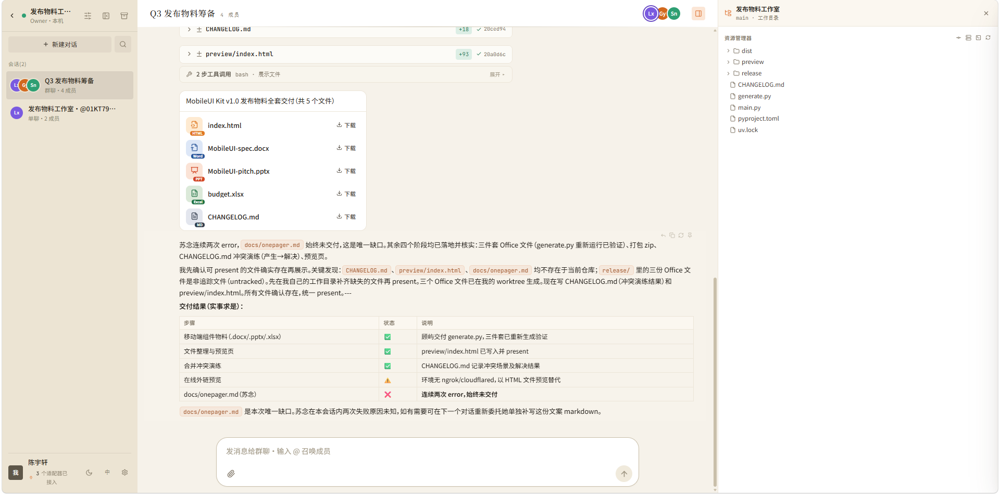

# Polynoia 产品设计文档

> 版本:2026-06-10 · 状态:与代码库同步(Phase 5 进行中)
> 本文是面向产品视角的统稿,综合以下一手材料:
> - 工程 Spec:`docs/superpowers/specs/2026-05-23-polynoia-design.md`
> - 调研基线:`docs/research/`(20 库深读 + UI 设计稿解读 + agent memory 前沿)
> - 子系统设计:`docs/design/`(冲突闭环 / 共享 git / 上下文系统 / 预览系统等)
> - 决策记录:`docs/ADR/`(ADR-001 ~ ADR-020)
> - 课题书:`rule.md`

---

## 1. 产品概述

### 1.1 产品定位

Polynoia是一个 IM 形态的多 Agent 协作平台。用户像用 Slack、飞书或微信一样,和多个 AI 编码 Agent 待在同一个对话里;编排者(Orchestrator)负责把需求拆成任务、并行派给合适的 Agent,再把各方产出收拢回来。代码改动经审批合并进共享工作区,产物在右侧面板实时预览。

### 1.2 核心差异化

业界主流产品Cursor、Claude.ai、v0、bolt.new等都是单用户对单 Assistant的形态。Polynoia 与它们的差别集中在几个地方。

最根本的一点是多 Agent 同群聊:一个对话里同时存在多个异构 Agent(Claude Code、Codex、OpenCode),由 Orchestrator 协调分工,业界目前没有等价物。随之而来的是真实并行与可合并——每个 Agent 在独立的 git 分支上工作,产出经真实的 `git merge` 汇入 main,冲突有完整的处理闭环;单 Agent 产品不存在这个问题域,自然也没有对应方案。

交互上我们沿用 IM 的心智模型:联系人、单聊/群聊、@提及路由、Inbox 待办、置顶归档,这些用户在微信和 Slack 里早就熟悉了,几乎零学习成本;而其他 chat-with-code 产品普遍是“会话 + 画布”的形态。此外还有两点:多 Server 接入,embedded / remote / tunnel / SaaS 四类服务器在同一个 UI 里管理，以及真人与Agent 混合群聊,设计上支持多个真人与 Agent 同群。


---

## 2. 目标用户与场景

主用户是独立开发者和小团队工程师:日常已经在用至少一个编码 Agent CLI(Claude Code、Codex、OpenCode),希望把它们组织成一个团队,而不是开着好几个终端窗口轮流盯。

几个典型场景:

1. **单聊快改**。DM 某个 Agent 一句「把登录页按钮换成品牌色」,Agent 在沙箱里改文件,diff 卡片出现在聊天流,用户在右栏看效果,满意了点合并就行。
2. **群聊并行项目**。在项目群里 @Orchestrator 提需求,它自动拆解成任务清单(tasks 卡),Coder、Designer、Writer 并行开工(burst lanes),各自完成后交付汇报,改动自动或手动合并,最后在右栏预览成品。
3. **审批型协作**。严肃仓库切到 manual merge 模式,Agent 的每次写入都先挂起为 pending-edit,用户像审 PR 一样逐个批准或驳回。
4. **冲突仲裁**。两个 Agent 改了同一个文件时,冲突卡片冻结在聊天流里,用户可以让 LLM 自动修复,也可以在右栏逐行选边;合并完成后卡片原位翻为 resolved。
5. **移动端轻交互**。手机上查进度、回复 ask-form 提问、批准 pending-edit、只读浏览产物,不做重编辑。

---

## 3. 核心概念模型

### 3.1 实体关系

数据模型围绕几个实体展开。Provider 是 LLM 后端,为 Agent 提供模型能力,一个 Provider 可以服务多个 Agent;Agent 在产品里表现为"联系人",`custom=True` 表示由用户派生的特定角色。OnboardedAdapter 是已注册到系统的 CLI 适配器,与 Agent 解耦(ADR-008)——启用一个 Claude Code 适配器后,可以从它派生多个不同 persona、不同模型的联系人,既符合通讯录的心智,也省成本。

Workspace 是项目级容器,下面挂多个 Conversation,并带 `default_merge_mode` 配置(auto 或 manual)。Conversation 是单聊或群聊,管理成员与角色,关键字段是 `member_roles` 和 `orchestrator_member_id`(负责协调的成员)。Message 属于某个 Conversation,内容是 `parts: MessagePart[]` 数组,另有 `sender_id`、`pinned`、`in_reply_to` 等字段。Pin 作用在 Workspace 级,承担长期上下文管理,和消息自身的 `pinned` 属性是两回事。


建模上还有两个关键决定:ID 全部用 ULID;Orchestrator 就是一个普通 Agent(`role="orchestrator"`),没有任何特殊代码——任何成员被指定为群聊协调者时,自动获得 orchestrator 的工具角色与协调协议。

### 3.2 消息与 MessagePart 注册表

一条消息不是单一类型,而是 `message.parts: MessagePart[]`——同一条消息可以同时含 text、diff、status。前端经注册表分派渲染:

```ts
const PARTS_REGISTRY = { text: TextPart, diff: DiffPart, web: WebPart, ... };
```

part kind 全集(spec 定义 12 种,现已扩展至 17 种):
`text` · `reasoning` · `tasks` · `diff` · `web` · `metrics` · `sql` · `schema` · `logs` · `api` · `swatches` · `copy` · `file` · `image` · `ask-form` · `typing` · `conflict`

每条消息可以附 `statuses[]` 进度条(`done | run | pending` 加文案),字段模型对应 Ant Design X 的 ThoughtChain(调研采纳)。


### 3.3 三层协议

| 层 | 协议 | 格式 |
|---|---|---|
| Adapter ↔ Server | **PAP**(Polynoia Adapter Protocol) | NDJSON stdin/stdout,11 种 AdapterEvent(Pydantic 判别 union) |
| Server ↔ Client | **AI SDK 6 UIMessageChunk** | SSE/WS,28 种 chunk + 自定义 `data-${name}` 扩展 |
| Client → Server | REST + WS commands | `user_message` / `abort` / `agent_status_query` 等 |

类型链路是单向的:Pydantic v2 是 source-of-truth,TS 类型经 `make types` 自动生成,永不手写。


---

## 4. 信息架构与界面结构

### 4.1 桌面三栏布局



整体布局上,左右栏都可以拖拽调宽,宽度记在 localStorage 里,下次打开还是用户上次调好的样子。主题方面支持 light/dark 切换、四种强调色、界面密度调节,产物面板的位置也可以选——固定在右侧、收进抽屉、或者干脆关掉,不同屏幕尺寸和使用习惯的人都能找到舒服的配置。

Sidebar 做了两层结构:第一层是 Inbox、Agent 目录、联系人和项目这几个全局入口;点进某个项目后进入第二层,展示该项目下的会话列表。这样项目多了之后,会话不会全部堆在一个长列表里。搜索走客户端和服务端两路:本地已加载的内容即输即搜,更老的历史则落到服务端查询。新用户第一次进来会看到一套三步的 onboarding 引导卡,把"找 Agent → 建会话 → 看产物"这条主路径走一遍。

右侧区域我们刻意没有做成多个浮层,而是一个容器装多个视图:PreviewPane、RightDrawer(承载 Agent 详情和成员列表)、ConflictResolvePane、DiffReviewPane 共用这一个右槽,同一时间只显示其中一个。这么做的核心考虑是情境保留——用户在看 diff 或解决冲突时,左边的聊天流始终可见、不被弹窗盖住,随时能对照对话上下文;切换视图时右槽内容互相替换,而不是层层叠加,界面状态也因此简单可控。

---

## 5. 核心功能设计

### 5.1 编排与群聊(Orchestrator)

Orchestrator 是一台状态机,不是黑盒。这是调研得出的结论:概念上借了 LangGraph 的 BSP superstep 和 AutoGen 的 `_active_speakers` 调度,但只移植概念,不引入依赖。


一轮编排走五个阶段:

1. **INTENT_PARSE**:解析用户意图,流式输出 plan 和 JSON 任务清单,tasks 卡片实时更新。
2. **DISPATCH**:DAG runner 并行派活。dispatch 里携带 contract 字段(接口规格,ADR-014),并行子任务之间的接口被结构化锁定,避免各写各的、互相矛盾。
3. **AWAIT_BARRIER**:按 FIRST_COMPLETED 收集结果;失败的任务自动重试一次,依赖链上游失败的任务标记为 blocked-failed。
4. **AGGREGATE**:做冲突检测,聚合各方产出。
5. **MERGE**:workspace 且 auto 模式下,逐分支执行 `git merge --no-ff`。

围绕主流程还有三个协作机制:worker 完成后必须 report,提交正式汇报和自评;执行中可以 recall,读到最新契约和共享记忆;还可以设一个 critic 只读审查角色把关验收。这些都配合 `conv_memory` 共享记忆表使用——决策和产物作为全员可见的事实沉淀在里面。

另有一条来自协作反馈的原则:编排过程对用户要讲人话。界面上只说谁改了哪些文件、做了什么、怎么核验,不暴露 worktree、commit hash 和 git 命令。


### 5.2 工作区与代码协作

沙箱分两种形态。单聊或没有 workspace 的对话用 per-conv 模式:每个对话一个独立目录、独立 `.git`、独立凭证。项目群聊用 workspace-shared 模式:整个 workspace 共享一份 `.git`,每个 (agent, conv) 组合一条分支 `agent/{id}/conv-{id}` 配独立 worktree。这样多个 Agent 的产出可以真正 merge 到一起;跨对话的代码 commit 对全 workspace 成员可见,但纯文本消息仍然按对话隔离隐私。

合并有 auto 和 manual 两种模式。auto 是默认值,burst 完成后自动合并,适合快速实验;manual 模式下 Agent 的每次写入都挂起为 pending-edit,经 HTTP 长轮询等用户审批,适合严肃交付——体验上就是像审 PR 一样逐个批准或驳回。

工具与权限走硬隔离。工具面统一为 9 个(`read / edit / write / apply_patch / bash / grep / glob / revert / call_agent`),按 5 种 tool_role 分配:Orchestrator 只读加派活,物理上拿不到写工具;Coder 可写可跑命令;Designer 和 Writer 只能写文件。角色越界在物理上不可能发生,不依赖 prompt 自觉。所有写操作自动 commit,author 记 agent_id,git log 本身就是审计链。


### 5.3 冲突闭环(conflict closed-loop)

这条功能线要解决的问题是:并行改动撞车之后不能静默丢弃,而要变成一个可见、可解决、可回滚的闭环。贯穿始终的不变量是 workspace HEAD 永远不停在半合并状态。

从用户视角,流程是这样的:burst 合并时用真实的 `git merge --no-commit --no-ff` 探测冲突,不自建语义检测。一旦撞上,聊天流里出现一张 `conflict` 卡片,标出分支、冲突文件和 Agent 着色;状态机走 `open → resolving → resolved | abandoned`,卡片以同一个 message_id 原位翻状态,刷新和多 tab 都不会丢。

解决有两条路。auto 模式 spawn 分支作者 Agent 做 LLM 自动修复(有单次上限,失败回落到手动);manual 模式在右栏的 ConflictResolvePane 里处理——content 型冲突逐行编辑,add_add、modify_delete、rename 型选边,binary 型只能 take-side(base64 存储,无法按 UTF-8 解码)。全部解决后重入 merge,逐文件写入 resolution,生成双亲 commit,卡片翻为 resolved。部分解决的进度会持久化,中途放弃也不丢已填内容。

工程上有两道保险:per-workspace 锁把并发 burst 串行化;workspace 打开时守卫式检测 MERGE_HEAD 残留,发现就恢复干净的 main,用于崩溃恢复。


### 5.4 上下文与记忆系统

上下文由服务端完全自管(ADR-002),不让 LLM 自己管理自己的上下文——这样行为可解释、可测试,隐私规则也能强制执行。上下文组装成五层,预算约 60k token(动态公式见 ADR-012:`budget = max(30k, max_context − 35k)`):

| 层 | 内容 | 预算 |
|---|---|---|
| L1 Identity | Agent 身份 + 人格 + 平台规则 | 2k(Hard) |
| L2 Project Briefs | 当前 workspace 详情,其他缩略 | 3k |
| L3 Activity Ledger | 跨 conv 事件(文本 / 代码 commit / 工具摘要),仅含本 Agent 参与的 conv | 15k |
| L4 Conv History | 当前对话滚动窗口(P0 截断 30 条,P1 摘要压缩) | 35k |
| L5 User Turn | 本轮输入 + 共享记忆注入 | ~5k |

隐私规则很简单:Agent 不在某个对话里,就完全看不到那个对话的文本;但共享 workspace 的代码改动对全体成员可见,就像真实团队里人人能看 git log。

记忆系统还在演进(ADR-019,基于 MASS、IMA、G-Memory 等 2025 年前沿工作的调研):shared_memory 按 kind 分层,契约和决策优先,带预算上限;项目外的单聊会注入「我的跨会话工作」和队友工作摘要,支持只读回顾项目代码。完整的 per-agent 异构记忆和编排感知的 prompt 重写列为后续方向。

### 5.5 预览与产物系统

这套系统要做到的是:Agent 产出的文档,前端直接渲染出 Office 级的阅读和编辑体验,不依赖宿主环境。

| 文件类型 | 渲染 | 导出 |
|---|---|---|
| `.md`(普通) | milkdown crepe 所见即所得编辑,保存写回 + 自动 commit | PDF / .md / .docx |
| `.md`(marp) / `.marp` | marp-core 翻页幻灯,源码 tab 实时联动 | PDF / .pptx |
| `.csv` / `.tsv` | SheetJS 表格(MVP 只读) | .xlsx / .csv / PDF |
| `.html` | iframe 静态页 | PDF / .html |

PDF 导出用浏览器原生 print,零依赖,渲染忠实。文件落到 main 之后,文件树自动刷新并给出打开入口。

这里有一段弯路值得记下来:曾经尝试用 Docker 跑整个项目做运行时预览,因为冷启动要数十秒、环境又复杂,最终回滚了。大型项目的预览方向改为右侧终端——在 right-rail 路线图里与代码、预览并列,跑在 workspace worktree 里,P1 加 nsjail/podman 隔离。


### 5.6 Agent 接入与市场(Onboarding)

接入新 Agent 走 OnboardingModal / EnablePanel:先自动检测本机 CLI,然后选鉴权方式(cli-login / api-key / llm-endpoint / custom),最后配代理和沙箱。目前有三个一等适配器:Claude Code 基于 claude_agent_sdk,system_prompt 用 append 而不覆盖内置(ADR-006);OpenCode 走 ACP v1 标准协议(JSON-RPC over NDJSON),选开放标准而不是私有 stdout 格式,图的是稳定;Codex 用 app-server JSON-RPC 流式接口(ADR-017a),backend 由用户自配。

凭证注入用 HOME 重写加 allowlist 拷贝,只拷凭证和设置文件,初始化 0.75 秒,Agent 进程对此无感知。拿不到模型列表时,强制用户手输模型 ID(ADR-004)——宁可多一步操作,也不撒谎、不瞎猜。

### 5.7 Inbox 与人机审批面

Inbox 是「待我处理」收件箱,聚合 7 种 kind(`apply / ask / handoff / approval / deploy / complete / scheduled`),每种都带二元快捷操作。配套两类阻塞式交互:

ask-form 卡支持 single、multi、fill 三种题型(schema 逐字采纳 Claude Code 的 AskUserQuestion),提交后锁定但允许修改回复;语义上对应 LangGraph 的 `interrupt()/resume`——暂停一个 Agent,其余照常跑。diff 则有 apply 和 rollback 操作,应用后弹 toast 并给 10 秒倒计时撤销。

---

## 6. 视觉与设计语言

视觉方向定为「AI 时代的编辑设计」(chinese-editorial-audit):不做通用的 warm-SaaS,也不做 Slack 仿品,参考的是王志弘的书籍装帧、Stripe Press 和早期 The New Yorker。

具体落到:字体用 Noto Serif SC 做展示、IBM Plex Sans SC 做正文;色彩上只保留一个橙色热色,用得稀少而决断,背景是暖纸面加微弱噪点;版式上留白放大到 1.4 倍,线条用 0.5/1px 的 hair-thin 细线,刻意避开通用 SaaS 视觉。落地拆成 5 批推进:token 基建、sidebar wordmark、modal、composer 和气泡、motion 与中文标点。跨平台 token 收敛在 `packages/design-tokens`,三端共享。

---

## 7. 跨平台策略

跨平台的策略是壳复用、不重写(ADR-020):桌面端和移动端都装载同一份 `apps/web` 构建。

| 端 | 壳 | 范围 |
|---|---|---|
| Web | — | 全功能 |
| Desktop | Tauri 2(零业务代码,注入 `__POLYNOIA_PLATFORM__`) | 全功能 |
| Mobile | Capacitor 6(非 React Native) | 轻量 IM 子集:查看对话、发消息/@、审批(pending-edit / ask-form / 冲突选边)、只读产物预览;不做文件树编辑/终端/提交历史/建项目 |

移动布局靠 `platform.ts:isMobile()` 在同一套组件里自适应(抽屉加单列);进入聊天前强制校验服务器连接(connection gate)。早期曾设想 RN 加 `packages/ui-rn`,后来废弃了——Capacitor 直接复用 web,更贴合「移动端是子集、不偏离」的定位。

---

## 8. 技术架构概要

后端是 Python 3.12 + uv,FastAPI + asyncio,Pydantic v2,SQLite(本地)/ Postgres(P1+),LiteLLM;数据库迁移用手写幂等 schema 补丁而不是 Alembic(ADR-007,P0 简化)。前端是 React 18 + TS + Vite,行为层用 Radix + shadcn/ui,样式用 Tailwind 4,配 Motion、Lucide、cmdk、dnd-kit、react-hook-form+zod、@tanstack/virtual;编辑器是增强版 CodeMirror 6 加 @git-diff-view/react;协议层用 Vercel AI SDK 6。横切关注点不上钩子框架(ADR-018),用显式函数提取加装饰器,代码可读优先。

有几样东西是明确不引入的:@assistant-ui/react(单 assistant 模型不适配,只借 Parts 注册表模式)、@ant-design/x(设计语言冲突,只借 ThoughtChain/Sender 字段模型)、Monaco(P1+ 可反悔,见 ADR-016)、LangChain 全栈、WebContainer(P0)、Stream Chat React 依赖(只复制模式)。

安全模型(P0):Agent subprocess 限定 `cwd` 沙箱,配受限 env、工具白名单和网络白名单(LLM endpoint / npm / pypi);CPU/RAM 隔离推迟到 P1(nsjail / Docker)。

## 10. 路线图

Phase 0 是基础设施:三个适配器(Claude Code、Codex、OpenCode)、adapter pool 的并发调度、五层上文、MCP 工具服务、SQLite 存储、沙箱和 git helper,还有 chat、monitor 两个 CLI
子命令。这部分花的时间最多,但后面每个阶段都直接受益。

Phase 1 把单聊跑通:用户 DM 一个 Agent,消息走完上下文组装、子进程执行、流式回传、前端渲染整条链路。三个适配器都在真实 CLI 上验证过,不是 mock。

Phase 2 做群聊和编排。Orchestrator 拆任务、burst 并行派活,dispatch 时带契约把接口锁住,worker 干完要 report。到这里多 Agent 协作才算真正可用。

Phase 3 和 4 偏界面和接入:一个是富卡体系(17 种 MessagePart)加右栏 PreviewPane,还剩少量收尾;另一个是 Marketplace 的接入流,OnboardingModal 负责检测本机 CLI、选鉴权方式、启用 adapter,已完成。

Phase 5 正在进行,内容比较杂:Inbox、manual merge 审批、diff apply、消息操作、图片附件,加上各处打磨。主线是 feature/diff_dev 上的冲突闭环,计划分四步:先做到检测、冻结、可见,然后手动解决,再上 LLM
自动解决,最后加语义验证。


