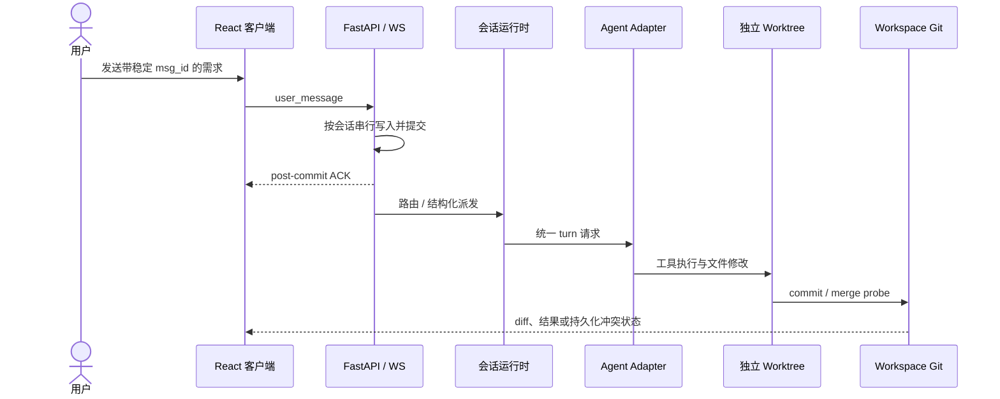

<!-- 候选 README：国内校招 / AI 应用工程与 Agent 工程方向。 -->

<p align="center">
  <a href="README.md">全部候选版本</a> ·
  <a href="README.global-oss.md">Global engineering</a> ·
  <a href="README.engineering-case-study.md">技术案例</a>
</p>

# Polynoia：把多 Agent 群聊做成一个可靠的工程系统

> 求职方向：AI 应用工程 / Agent 工程 / 全栈工程

Polynoia 不是“聊天页面接一个大模型”的 Demo。它把 Claude Code、Codex、OpenCode
统一到一套 Agent 运行时里，并继续处理模型调用之后真正困难的工程问题：异构协议如何
归一、并发任务如何只收尾一次、多个 Agent 如何隔离并合并代码、断线重连时消息如何不丢
不重，以及旧页面数据如何不覆盖新状态。

<p align="center">
  
</p>

> **贡献边界：**本仓库由多人协作完成。下文只陈述能够由代码、测试、设计记录和
> Git 历史验证的项目实现，不把仓库总提交数包装成个人工作量，也不声称独立开发。

## 30 秒看懂

用户在一个类似 IM 的界面里向多个 Coding Agent 提需求。协调者把任务拆成结构化子任务，
Claude Code、Codex、OpenCode 通过统一协议并行执行；在绑定 workspace 的项目会话中，
每个 Agent 在自己的 Git worktree 里改代码；系统再做真实 Git 合并，把文本、diff、工具
调用、文件、预览和冲突以结构化消息带回对话。

项目的重点不是“同时调几个模型”，而是为并发、失败和重连定义清楚的状态机与边界。

| 可核验规模 | 当前口径 |
|---|---:|
| 一等 Agent 适配器 | 3 个：Claude Code / Codex / OpenCode |
| 统一 AdapterEvent | 11 类判别式事件 |
| 后端消息 payload | 22 种；`discussion` 走专门渲染路径 |
| 客户端形态 | Web / Tauri 桌面 / Capacitor 移动 |
| 自动化测试文件 | 121 个：后端 81、前端 40 |
| 消息专项实测 | 250 次快速追加 + 50 次稳定 ID 重放 |

最后一项来自 2026-07-20 的专项记录，不代表生产容量上限；测试文件数也不等于所有测试
当前全绿。

## 一条完整的数据流



## 六个值得在面试里展开的问题

### 1. 三种 Agent CLI，为什么不在业务层分别适配

**问题：** Claude Code 是 SDK 双向流，OpenCode 是 ACP v1 JSON-RPC/NDJSON，Codex
使用 app-server JSON-RPC v2。事件名、工具状态和会话生命周期都不同。

**方案：** 服务端定义判别式 `AdapterEvent`，每个 Adapter 只负责把原生协议翻译为
统一事件，再由 transport 层映射成客户端 chunk。这样业务编排、工具卡和 UI 不需要为每个
模型重写。

**权衡：** 统一层不能抹平所有能力差异；Codex app-server 仍属于较新的集成路径，真实 CLI
测试依赖本机凭据。

**证据：**
[`adapters/base.py`](../../apps/server/polynoia/adapters/base.py) ·
[`claude_code.py`](../../apps/server/polynoia/adapters/claude_code.py) ·
[`opencode.py`](../../apps/server/polynoia/adapters/opencode.py) ·
[`codex.py`](../../apps/server/polynoia/adapters/codex.py) ·
[ADR-021](../ADR/ADR-021-codex-app-server-streaming.md)

### 2. 多个 worker 同时完成，如何防止 merge 两次

**问题：** 并发 worker 的完成回调如果都看到 `pending` 为空，可能重复触发合并和总结；
另一种失败是某个 worker 异常后任务永远不收尾。

**方案：** `BurstStateMachine` 在第一次 `await` 之前同步完成“更新状态 → 移出 pending →
最后一个 worker claim → 立即 pop 注册表”。异步持久化和 merge 发生在 claim 之后，因此
只有一个完成者拥有收尾权。

**权衡：** 这个原子性依赖单进程 asyncio 的协作式调度；水平扩展需要数据库或分布式锁。

**证据：**
[`api/execution.py`](../../apps/server/polynoia/api/execution.py) ·
[`test_burst_state_machine.py`](../../apps/server/tests/api/test_burst_state_machine.py)

### 3. 多 Agent 同时改一个仓库，如何隔离又真正合并

**问题：** 共享目录会互相踩文件；完全独立仓库又无法形成一个真实、可审查的最终结果。
并发首次创建 worktree 还会发生 branch 竞争、短 ID 碰撞和 Git 幽灵注册。

**方案：** 一个项目 workspace 共享 Git 对象库和集成分支，每个
`(agent, conversation)` 使用独立分支与 worktree。完整身份决定所有权；创建过程在
workspace setup lock 内收敛；清理先执行 `git worktree remove --force` 再 prune；只读
handle 的 cleanup 明确为 no-op。未绑定项目的私聊不走这条 worktree 路径。

**权衡：** worktree 是协作隔离，不是恶意代码的 OS 级安全沙箱。

**证据：**
[`sandbox/_core.py`](../../apps/server/polynoia/sandbox/_core.py) ·
[`test_workspace_sandbox.py`](../../apps/server/tests/sandbox/test_workspace_sandbox.py)

### 4. “消息不丢不重”为什么不只是 optimistic bubble

**问题：** 原实现收到每一帧就创建独立数据库任务，SQLite 写锁竞争会让后发消息先入库，
甚至出现 `database is locked`。浏览器也会在没有持久化确认时先显示“已发送”。

**方案：** 服务端按 conversation 串行执行短持久化区段；稳定 `msg_id` 使用 append-once
身份比较；只有提交后才 ACK。浏览器持有内存 outbox，在 replacement socket 上 FIFO
重放未确认帧。旧物理 socket 仍可确认它确实发送过的同一帧，但其迟到的可重试 NACK
不能让 replacement socket 回退或重复排队。

**权衡：** 这里保证的是 **exactly-once durable append**，不是 exactly-once Agent 执行；
浏览器进程重启后 outbox 不持久化。

**证据：**
[`message stability design`](../superpowers/specs/2026-07-20-message-append-stability-design.md) ·
[`storage/repo/messages.py`](../../apps/server/polynoia/storage/repo/messages.py) ·
[`lib/ws.ts`](../../apps/web/src/lib/ws.ts) ·
[`test_ws_message_append_stability.py`](../../apps/server/tests/api/test_ws_message_append_stability.py)

### 5. WebSocket 已经更新，旧 REST 历史为什么还能把界面改回去

**问题：** 首屏 GET 很慢时，实时 update/remove 可能先到；旧 GET 返回后，如果直接覆盖
store，就会把旧消息重新插回页面。对话切换、rewind、失败草稿恢复会放大这个竞态。

**方案：** 水合请求记录 sequence、destructive revision、开始时的对象身份和 delivery
保护集合。更旧请求输给更新请求；请求期间创建或修改的对象保留当前值；update-before-page
会让旧快照失效并触发权威重取。

**权衡：** 因果合并增加了状态机复杂度，所以用确定性的竞态测试固定顺序，而不是依赖
`setTimeout` 猜测。

**证据：**
[`store.ts`](../../apps/web/src/store.ts) ·
[`store.messageHydrationRace.test.ts`](../../apps/web/src/store.messageHydrationRace.test.ts) ·
[`optimisticMessageDelivery.ts`](../../apps/web/src/components/optimisticMessageDelivery.ts)

### 6. 断线恢复为什么可能把已完成工具改回失败

**问题：** 恢复接口读到 `running` 后，正常工具流可能先提交 `completed`；旧恢复逻辑随后
覆盖成 `error`。即使数据库最终正确，最后广播一帧旧 `error`，UI 仍会显示失败。

**方案：** SQLite 在读取前获取 writer slot，其他数据库用行锁；恢复和正常工具流共享
会话 transition lock，并把锁持有到对应 outbound frame 完成。终态之后迟到的
`pending/running` 帧被拒绝并从输出流抑制。

**权衡：** 这是单调状态约束；它不能撤销外部工具已经产生的部分副作用。

**证据：**
[`api/routes.py`](../../apps/server/polynoia/api/routes.py) ·
[`api/ws_conv.py`](../../apps/server/polynoia/api/ws_conv.py) ·
[`test_rewind_replay.py`](../../apps/server/tests/api/test_rewind_replay.py)

## 为什么它不是普通聊天壳

| 维度 | 普通模型聊天 | Polynoia 的工程对象 |
|---|---|---|
| 模型接入 | 一家 API | 三种 CLI/SDK → 统一事件协议 |
| 并行 | 多发几个 Promise | burst 注册、最后完成者 claim、结构化 handoff |
| 受管文件修改 | 共享目录直接写 | 专用文件工具写入 Agent worktree + 真实 Git merge |
| 消息发送 | optimistic 即成功 | post-commit ACK + 内存 outbox + stable ID |
| 页面恢复 | GET 覆盖 store | 因果水合 + destructive revision |
| 工具状态 | 来一帧画一帧 | 终态单调 + 提交/广播顺序一致 |
| 失败 | toast / 字符串 | 可重试 NACK、持久 conflict、可恢复 ask/rewind |

## 工程验证

项目的回归测试会主动构造失败窗口，而不只测试 happy path：

- 同一 socket 和跨 socket 的消息乱序；
- 稳定 ID 精确重放与冲突重放；
- 旧 socket 迟到 ACK、硬断网、半包 SSE；
- update/remove 早于首屏历史；
- 八路并发首次创建同一 worktree；
- 完整 ID 尾部碰撞、幽灵 worktree 注册、只读根目录误删；
- merge crash、残留冲突标记和重复 merge 循环；
- 工具 `running/completed/error` 反向竞态。

专项记录中的发布门禁包括：后端离线套件通过（排除依赖真实 Claude 凭据的集成项）、
消息相关前端回归与构建通过、真实 Uvicorn 下 250 条 FIFO 追加和 50 条精确重放通过。
前端全量曾记录为 330/331，唯一失败在未改动 main 上也能复现；因此这里不写“所有测试
全绿”。

## 快速运行

```bash
git clone https://github.com/JuneQQQ/polynoia.git
cd polynoia
make install
make dev
```

- Web：`http://127.0.0.1:7788`
- API：`http://127.0.0.1:7780`

需要 Python 3.12+、`uv`、Node.js 22+、pnpm 9（或 npm 7+），以及至少一个已登录的 Agent
CLI 才能获得真实模型回复。

```bash
make test
make lint
make build
```

`scripts/seed_demo.py` 和 `scripts/testkit/reset.sh` 会重建本地状态，不应作为普通启动步骤
直接执行。

## 面试官阅读路径

### 5 分钟

1. [30 秒看懂](#30-秒看懂)
2. [一条完整的数据流](#一条完整的数据流)
3. [为什么它不是普通聊天壳](#为什么它不是普通聊天壳)

### 15 分钟

- 偏后端 / 分布式状态：看[消息可靠性](#4-消息不丢不重为什么不只是-optimistic-bubble)
- 偏 Agent 平台：看[异构协议归一](#1-三种-agent-cli为什么不在业务层分别适配)
- 偏工程协作：看[Git worktree](#3-多-agent-同时改一个仓库如何隔离又真正合并)
- 偏前端状态：看[因果水合](#5-websocket-已经更新旧-rest-历史为什么还能把界面改回去)

### 30 分钟

- [消息可靠性设计](../superpowers/specs/2026-07-20-message-append-stability-design.md)
- [冲突闭环 Charter](../design/conflict-closed-loop-CHARTER.md)
- [ADR 决策记录](../ADR)

## 常见追问

| 面试追问 | 回答边界 | 代码入口 |
|---|---|---|
| 这是真多 Agent，还是一个模型扮演多人？ | 三个真实 Adapter session、并行任务、独立 worktree | [`adapters`](../../apps/server/polynoia/adapters) |
| 生产编排到底在哪？ | 主路径是 `api/ws_conv.py`，不是遗留 runtime | [`ws_conv.py`](../../apps/server/polynoia/api/ws_conv.py) |
| 两个 worker 会 merge 两次吗？ | 同步 last-claim + pop；只在单进程边界内成立 | [`execution.py`](../../apps/server/polynoia/api/execution.py) |
| exactly-once 到底是哪一层？ | durable append，不是 Agent execution | [message design](../superpowers/specs/2026-07-20-message-append-stability-design.md) |
| 能解决语义冲突吗？ | Git 只保证结构合并；语义正确性仍需测试/验收 | [conflict charter](../design/conflict-closed-loop-CHARTER.md) |
| Agent 能否越权访问宿主机？ | 文件类接口有 workspace 路径校验，工具集按角色收窄；但 `bash` 仍以宿主权限执行，因此没有 OS 级强隔离 | [`mcp`](../../apps/server/polynoia/mcp) |
| 500 个场景都通过了吗？ | 场景库存不等于实跑通过数，不能混写 | [`scripts/testkit`](../../scripts/testkit) |

## 已知边界

- 当前锁主要是进程内锁，多服务实例需要外部协调。
- 没有跨浏览器进程重启的持久 outbox。
- 不保证消息提交后、Agent turn 启动前崩溃时的 exactly-once 执行。
- worktree 和文件类路径校验不是容器或 namespace 级安全沙箱；任意 shell 执行仍依赖宿主权限。
- 三种 Adapter 和 Web/桌面/移动端的成熟度并不完全相同。
- 仓库当前没有 LICENSE，不能把“公开可见”等同于“已开源授权”。

## 仓库导航

```text
apps/web/                         React 客户端与状态机
apps/server/polynoia/api/         WebSocket、REST、运行时入口
apps/server/polynoia/adapters/    三种 Agent 协议适配
apps/server/polynoia/context/     分层上下文与预算
apps/server/polynoia/mcp/         工具注册、权限和执行
apps/server/polynoia/sandbox/     Git/worktree/merge
apps/desktop/                     Tauri 壳
apps/mobile/                      Capacitor 壳
docs/ADR/                         技术决策记录
docs/testing/                     测试与压力记录
```

## 可用于简历的诚实表达

> 参与构建本地优先的多 Agent 协作平台，将 Claude Code、Codex、OpenCode 归一为统一
> 流式事件协议；围绕 Git worktree 隔离与冲突闭环、WebSocket post-commit ACK 与重连
> 重放、前端因果水合等问题建立状态机和对抗性回归测试。项目采用 FastAPI + React，
> 复用 Tauri / Capacitor 壳覆盖桌面与移动形态。

这段话不声称独立开发，也没有把历史场景库存或仓库总提交数包装成个人指标。

<p align="center"><sub>把 Agent 能力做成可解释、可恢复、可验证的工程系统。</sub></p>
