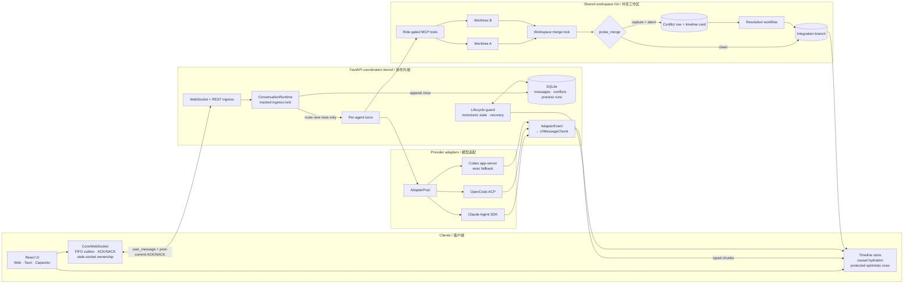

<!-- Candidate README: English-first deep case study with Chinese framing. -->

<p align="center">
  <a href="README.md">All candidates</a> ·
  <a href="README.global-oss.md">Global engineering</a> ·
  <a href="README.campus-cn.md">国内校招</a>
</p>

# Polynoia — Reliability is the product

## 可靠性才是产品

Polynoia is not best understood as another multi-agent chat UI. It is a
local-first coordination kernel that turns unreliable, stateful agent
subprocesses into replayable, conflict-aware workflows.

Polynoia 不该被讲成“又一个多 Agent 聊天界面”，而应讲成一个本地优先的协作内核：
它把会断线、会乱序、会崩溃、协议各异的 Agent 子进程，约束成可重放、可合并、可审计的
工作流。

<p align="center">
  
</p>

This case study follows the failures that shaped the system. Each story uses the
same structure: **visible failure → root cause → invariant → implementation →
verification**.

本文不靠功能清单证明复杂度，而是沿着真实失败回溯系统不变量。

## Five invariants / 五条不变量

| Invariant | 不变量 | Owner |
|---|---|---|
| Accepted messages commit in conversation FIFO order | 已接受消息按会话 FIFO 顺序提交 | Conversation ingress |
| A stable message ID appends once and never overwrites different content | 稳定 ID 只能追加一次，不能覆盖不同内容 | Storage repository |
| Dedicated file-tool mutations are path-confined and committed branch-locally; shell commands retain host-user filesystem authority | 专用文件工具受路径约束并提交到独立分支；shell 仍保留宿主用户的文件系统权限 | Workspace Git protocol + explicit security boundary |
| Terminal tool/process state never moves backward | 工具和进程终态不可逆 | Lifecycle state machine |
| Provider and OS variance stops at explicit adapters | Provider 与操作系统差异止于边界适配层 | Adapter / launcher boundary |

These are scoped guarantees. They do not imply multi-process consensus, durable
offline delivery, exactly-once model execution, or hostile-code isolation.

## Architecture / 系统架构



Every arrow above crosses an invariant boundary. The important design question
is not only “which component calls which,” but “who owns durable truth when that
call is interrupted?”

## Incident timeline / 故障演进

| Date | User-visible failure | Invariant introduced |
|---|---|---|
| 2026-05-31 | Codex looked frozen, then emitted one completed block | Provider streams normalize before reaching UI semantics |
| 2026-05 onward | Parallel branches half-merged or reopened the same conflict | Merge probe is reversible; conflict state is durable; resolved branches advance |
| 2026-06 onward | Tool/terminal cards stayed running or resurrected after completion | Lifecycle truth is backend-owned and terminal states are monotonic |
| 2026-06-14 | Unix process assumptions prevented Windows backend startup | OS-specific behavior is isolated behind launch and capability boundaries |
| 2026-07-20 | Messages overtook, duplicated, disappeared, or lost to stale hydration | Commit-order ACK, append-once IDs, socket ownership, and causal hydration |

## Case 1 — Normalize provider streams

### Failure / 现象

The first Codex integration used `codex exec --json`. It exposed a completed
agent message but not the token granularity expected by the UI, so the answer
appeared frozen and then arrived as one block.

最初的 Codex 接入把 provider 原生输出直接当作 UI 语义，导致流式展示与具体 CLI 传输
耦合。

### Root cause / 根因

Provider transports disagree on session lifecycle, token deltas, reasoning,
tool events, and failure representation. Passing native payloads upward makes
every UI and orchestration feature provider-specific.

### Invariant and design / 不变量与设计

- Codex defaults to the long-lived app-server JSON-RPC v2 transport.
- Claude Code, OpenCode, and Codex all translate into one discriminated
  `AdapterEvent` union.
- A second pure translator maps normalized events into UI chunks.
- `POLYNOIA_CODEX_TRANSPORT=exec` remains an operational escape path.

### Proof / 验证

- [ADR-021: Codex app-server streaming](../ADR/ADR-021-codex-app-server-streaming.md)
- [Adapter event contract](../../apps/server/polynoia/adapters/base.py)
- [Codex adapter](../../apps/server/polynoia/adapters/codex.py)
- [Adapter-to-chunk translator](../../apps/server/polynoia/transport/adapter_to_chunk.py)
- [Codex translation regressions](../../apps/server/tests/adapters/test_event_translation_codex_appserver.py)

**Lesson:** normalization is not compatibility plumbing. It makes streaming
correctness and recovery testable without a live provider process.

## Case 2 — Worktree isolation is a protocol, not a directory

### Failure / 现象

Early parallel merges could leave the integration root half-merged, probe from
the wrong worktree, create duplicate conflict cards, or reopen the same conflict
indefinitely. A recorded campaign produced repeated open conflicts because the
resolved source branch remained ahead and was probed again.

### Root cause / 根因

- Linked worktrees share repository-level state.
- Conversation-scoped locking is too narrow when multiple conversations share a
  workspace.
- A destructive merge probe contaminates the integration root.
- Transient conflict exceptions do not survive restart or competing drains.
- Resolving main without advancing the source worktree reopens the same delta.

### Invariant and design / 不变量与设计

1. In a workspace-backed project conversation, every `(agent, conversation)`
   owns a dedicated branch and worktree; projectless direct messages do not.
2. Workspace identity—not conversation identity—keys shared setup and merge
   serialization.
3. `probe_merge` performs a temporary merge, captures conflict data, then aborts
   in the normal path; a later probe detects and cleans crash residue before
   reusing the integration root.
4. Conflicts become durable rows and typed timeline state.
5. `conclude_merge` performs the real locked merge and cleans merge state in
   `finally`.
6. Successful resolution advances the source worktree to the integrated branch.
7. Lifecycle recovery handles colliding readable suffixes, orphan directories,
   and registered-path mismatches.

### Proof / 验证

- [Worktree and merge implementation](../../apps/server/polynoia/sandbox/_core.py)
- [Conflict repository](../../apps/server/polynoia/storage/repo/conflicts.py)
- [Conflict merge tests](../../apps/server/tests/sandbox/test_conflict_merge.py)
- [Conflict flow tests](../../apps/server/tests/api/test_conflict_flow.py)
- [Competing-drain tests](../../apps/server/tests/api/test_conflict_double_spawn.py)
- [Recorded repeated-merge incident](../testing/stress-campaign-report.md)

**Lesson:** a worktree is useful isolation only when ownership, repository-wide
locking, reversible probing, cleanup, and durable conflict state form one
protocol.

## Case 3 — Terminal state must be monotonic

### Failure / 现象

Terminal cards could remain blocking after their process died. Delayed snapshots
could overwrite a completed card with `running`. A restart stranded in-flight
process and write/edit cards. A recovery request could even commit `error` while
a normal completion committed `completed`, then broadcast frames in the opposite
order.

### Root cause / 根因

Lifecycle ownership lived in short-lived subprocesses, multiple producers could
report state, and persistence order was not coupled to broadcast order.

### Invariant and design / 不变量与设计

- The backend database owns process and tool lifecycle.
- Terminal snapshots carry monotonic sequence/state rules.
- Terminal outcomes cannot regress to pending/running.
- Output snapshots do not shrink.
- Startup reapers and periodic liveness sweeps reconcile abandoned rows.
- Write/edit interruption uses database serialization plus the conversation
  transition lock through its matching outbound frame.
- Frontend reducers independently reject stale running resurrection.

### Proof / 验证

- [ADR-023: backend-owned terminal lifecycle](../ADR/ADR-023-terminal-card-lifecycle-backend-owned.md)
- [Process cleanup repository](../../apps/server/polynoia/storage/repo/cleanup.py)
- [Streamed tool transition guard](../../apps/server/polynoia/api/ws_conv.py)
- [Restricted interruption endpoint](../../apps/server/polynoia/api/routes.py)
- [Frontend chunk reducers](../../apps/web/src/lib/chunkReducers.ts)
- [Concurrent transition regressions](../../apps/server/tests/api/test_rewind_replay.py)

**Lesson:** terminal status is a state machine, not a label. Once several
producers can report lifecycle state, monotonicity becomes a correctness rule.

## Case 4 — Message correctness spans five layers

### Failure / 现象

Two frames from one socket could persist out of order. SQLite returned
`database is locked`. Stable-ID replay could reroute work twice. The UI treated
socket `send()` as delivery. Receipts could affect a replacement without proving
that their physical socket sent the same frame, and a slow history request could
erase newer live or optimistic rows.

### Root cause / 根因

Every WebSocket frame spawned an independent background database task. There was
no append-once identity rule, post-commit receipt, coordinated outbox, physical
socket ownership check, or hydration fence.

### Invariant and design / 不变量与设计

```text
database append
    → post-commit ACK/NACK
        → reconnect outbox ownership
            → optimistic delivery protection
                → causal REST hydration
```

- A tracked per-conversation lock preserves accepted ingress order.
- `append_message_once` compares `(conv_id, sender_id, payload, in_reply_to)`.
- Exact replay ACKs without rerouting; conflicting reuse never overwrites.
- Retryable NACK stops the socket so later frames cannot jump a failed gap.
- Same-conversation clients share an insertion-ordered in-memory outbox.
- A receipt is useful only for the exact frame its physical socket sent. An old
  socket may still deliver a valid ACK for that frame, while stale retryable NACK
  advice is ignored after handoff.
- Reconnect flushes pending messages before status reconciliation.
- Hydration captures request sequence, destructive revision, object identity,
  and protected delivery state; stale responses merge current-wins or disappear.

### Proof / 验证

- [Reliability contract and non-goals](../superpowers/specs/2026-07-20-message-append-stability-design.md)
- [Append-once repository](../../apps/server/polynoia/storage/repo/messages.py)
- [Tracked ingress lock](../../apps/server/polynoia/api/execution.py)
- [WebSocket ingress](../../apps/server/polynoia/api/ws_conv.py)
- [Coordinated browser outbox](../../apps/web/src/lib/ws.ts)
- [Causal hydration](../../apps/web/src/store.ts)
- [Backend message races](../../apps/server/tests/api/test_ws_message_append_stability.py)
- [Frontend hydration races](../../apps/web/src/store.messageHydrationRace.test.ts)

**Lesson:** fixing persistence alone leaves the same user-visible lie in receipt
handling, optimistic state, reconnect ownership, or hydration.

## Case 5 — Cross-platform means explicit capability boundaries

### Failure / 现象

Unix PTY imports ran at module scope. Uvicorn reload selected a Windows event
loop that could not spawn adapter subprocesses. Console children could flash or
die with their parent window. Make/bash-only entry points excluded Windows
development.

### Invariant and design / 不变量与设计

- Unix-only PTY imports are guarded and unsupported interactive terminals close
  explicitly instead of crashing server startup.
- A programmatic Windows launcher preserves the Proactor event loop through
  reload.
- Windows child creation uses `CREATE_NO_WINDOW`.
- PowerShell install, dev, and desktop build entry points mirror the supported
  workflow.

### Proof / 验证

- [Windows event-loop policy](../../apps/server/polynoia/_winloop.py)
- [Programmatic server launcher](../../apps/server/polynoia/__main__.py)
- [Windows subprocess patch](../../apps/server/polynoia/__init__.py)
- [Terminal capability boundary](../../apps/server/polynoia/api/terminal.py)
- [`install.ps1`](../../install.ps1) · [`dev.ps1`](../../dev.ps1) ·
  [`build-desktop.ps1`](../../build-desktop.ps1)

**Lesson:** cross-platform robustness comes from isolating platform policy and
degrading unsupported capabilities honestly—not pretending every OS is Unix.

## Invariant ledger / 不变量账本

| Invariant | Durable truth | Ordering / lock | Recovery | Regression surface |
|---|---|---|---|---|
| Message append-once | Message row | Conversation ingress lock | Replay with stable ID | storage + WS tests |
| Socket settlement ownership | In-memory outbox entry | Physical socket membership | Replacement-socket FIFO flush | `ws.test.ts` |
| Causal hydration | Timeline store + revisions | Request sequence / destructive revision | Authoritative refetch | hydration race tests |
| Path-confined file-tool writes | Git branch/worktree | Workspace setup lock | Registered-path/orphan recovery | workspace sandbox tests |
| Clean integration root | Git + conflict row | Workspace merge lock | abort in probe; cleanup in finally | conflict tests |
| Terminal monotonicity | Process/tool row | DB writer/row lock + transition lock | startup reaper + liveness sweep | process/rewind/reducer tests |
| Provider independence | AdapterEvent | Adapter session lifecycle | normalized failure/end events | translation tests |

## Verification / 验证

Fresh targeted verification for this case-study surface:

```text
Backend:   136 passed
Frontend:  120 passed across 6 test files
```

Backend coverage includes append/replay ordering, conflict probe and resolution,
competing merge drains, three adapter translators, process recovery, tool
persistence, and rewind/transition races. Frontend coverage includes ordered
outbox behavior, reconnect ownership, causal hydration, monotonic reducers,
stuck write recovery, and real send call sites.

These are targeted results, not a claim that every repository test, provider
credential, OS, or packaging path was freshly executed.

Repository-recorded live evidence remains separately labeled:

- Codex live probe: a 25-word answer emitted 24 deltas —
  [ADR-021](../ADR/ADR-021-codex-app-server-streaming.md)
- four stuck terminal cards reconciled to zero —
  [process lifecycle session](../sessions/2026-06-10-pingpong-and-process-lifecycle.md)
- a dated 20/20 overnight scenario campaign —
  [overnight E2E record](../sessions/2026-06-overnight-e2e.md)
- 250 rapid message appends plus 50 exact replays —
  [message stability plan](../superpowers/plans/2026-07-20-message-append-stability.md)

## Known boundaries / 已知边界

- Conversation and workspace locks are process-local; this is not a
  multi-instance consensus protocol.
- The browser outbox is memory-only and does not survive a full page/process
  restart.
- A crash between message commit and model-task creation is not exactly-once
  model execution.
- SQLite is the supported topology; this document does not claim finished
  PostgreSQL operations.
- Worktrees, file-tool path checks, and role-filtered tool sets are collaboration
  controls, not hostile-code isolation. MCP `bash` still runs with host-process
  authority; there is no CPU/RAM/network namespace boundary.
- Codex app-server is a newer transport and real integration tests depend on
  installed CLI credentials.
- Windows does not provide the Unix interactive PTY endpoint, and Windows-only
  behavior is not claimed as freshly CI-verified here.
- The public repository currently has no LICENSE; public visibility is not an
  open-source grant.

## Repository map / 代码导航

```text
apps/server/polynoia/adapters/     provider → AdapterEvent
apps/server/polynoia/transport/    AdapterEvent → UI chunks
apps/server/polynoia/api/          ingress, turns, recovery, runtime state
apps/server/polynoia/storage/      messages, conflicts, lifecycle truth
apps/server/polynoia/sandbox/      worktrees, Git merge, conflict capture
apps/server/polynoia/mcp/          role-gated tools
apps/web/src/lib/ws.ts              browser outbox and socket ownership
apps/web/src/store.ts               causal timeline reconciliation
docs/ADR/                           architecture decisions
docs/testing/                       stress and verification records
```

## Run locally / 本地运行

Prerequisites: Python 3.12+, `uv`, Node.js 22+, pnpm 9 (canonical) or npm 7+,
and at least one authenticated supported Agent CLI for real model responses.

macOS / Linux:

```bash
make install
make dev
```

Windows PowerShell:

```powershell
.\install.ps1
.\dev.ps1
```

The web client runs at `http://127.0.0.1:7788`; the API runs at
`http://127.0.0.1:7780`. Real agent responses require at least one authenticated
supported CLI.

## Design record / 设计记录

- [Polynoia design](../superpowers/specs/2026-05-23-polynoia-design.md)
- [Message stability design](../superpowers/specs/2026-07-20-message-append-stability-design.md)
- [Conflict closed-loop charter](../design/conflict-closed-loop-CHARTER.md)
- [ADR-021: Codex streaming](../ADR/ADR-021-codex-app-server-streaming.md)
- [ADR-023: terminal lifecycle](../ADR/ADR-023-terminal-card-lifecycle-backend-owned.md)

<p align="center"><sub>Make failure states explicit. Make recovery paths executable.</sub></p>
