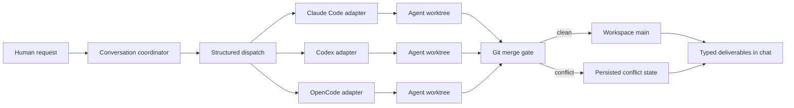

<!-- Candidate README: global engineering / future OSS audience. -->

<p align="center">
  <a href="README.md">All candidates</a> ·
  <a href="README.campus-cn.md">国内校招</a> ·
  <a href="README.engineering-case-study.md">Engineering case study</a>
</p>

# Polynoia

## Reliability-first multi-agent engineering, grounded in Git

Polynoia is a local-first workspace for coordinating Claude Code, Codex, and
OpenCode on one repository. In a workspace-backed project conversation, a
coordinator dispatches structured work, each agent runs in a dedicated Git
worktree, and the system brings results back through a typed, reviewable
conversation.

The interesting part starts after the model call: ordering messages, replaying
after reconnects, preventing worktree races, converging tool state, preserving
conflicts, and making every handoff visible to a human.

<p align="center">
  
</p>

> **Current status — v0.1.4:** early-stage, single-node software for local
> engineering workflows. The repository is public, but it does not currently
> declare a software license; do not assume reuse or redistribution rights until
> a license is added.

## Why Polynoia exists

Most coding-agent products optimize one conversation with one model. Real team
work adds a different class of problems:

- several agent runtimes speak incompatible streaming protocols;
- parallel workers can edit the same repository at the same time;
- a WebSocket can disappear after a message looks sent but before it is durable;
- stale history can overwrite a newer optimistic or streamed state;
- a merge conflict is a durable workflow state, not an exception string;
- tool cards and agent output must not move backward from terminal to running.

Polynoia treats these as system contracts instead of UI polish.

## One request, end to end



1. The web client sends a stable message identity through WebSocket.
2. The server commits the user row before acknowledging it.
3. Conversation structure determines coordinator and worker authority.
4. Adapters translate three different agent runtimes into one event model.
5. Workers edit independent worktrees backed by one workspace Git repository.
6. Git performs the real merge; conflicts remain explicit and recoverable.
7. Text, reasoning, tasks, diffs, tools, files, previews, and conflicts arrive as
   typed message payloads rather than an unstructured transcript.

## Quick start

### Prerequisites

- Python 3.12+
- [`uv`](https://docs.astral.sh/uv/)
- Node.js 22+ with pnpm 9 (canonical) or npm 7+
- at least one authenticated supported agent CLI for real model responses

```bash
git clone https://github.com/JuneQQQ/polynoia.git
cd polynoia
make install
make dev
```

Open `http://127.0.0.1:7788` for the client. The API listens on
`http://127.0.0.1:7780`.

```bash
make test     # backend pytest + frontend Vitest
make lint     # Ruff + Biome
make build    # production build
```

> Demo/reset scripts rebuild local state. Read them before running them; they are
> intentionally not part of the normal quick start.

## The contracts that matter

| Boundary | Implemented contract | Deliberate limit |
|---|---|---|
| Message ingress | FIFO inside one conversation; stable-ID append-once; changed-content ID reuse is rejected; ACK follows commit | No durable browser outbox across a full page restart; no exactly-once model execution after a server crash |
| Reconnect | Unacknowledged frames replay on a replacement socket; an old socket may still ACK the exact frame it sent, but stale retry advice cannot requeue the replacement | The current guarantee targets a single server process |
| Agent isolation | In a workspace-backed project conversation, each `(agent, conversation)` receives its own branch and worktree | Projectless direct messages do not use this Git-worktree path; it is not an OS security boundary |
| Worktree lifecycle | Setup is serialized; concurrent first-open converges; full identities prevent short-suffix collisions; cleanup runs `git worktree remove --force` and then prunes | Multi-process coordination needs a file- or database-backed lock |
| Merge | Git three-way merge is the source of truth; conflict state survives for a later resolution path | Structural merge success does not prove semantic correctness |
| Tool cards | Late nonterminal frames cannot reopen an error/completed terminal state | External tools can still fail or produce partial side effects |

The full message contract and non-goals are documented in the
[message append stability design](../superpowers/specs/2026-07-20-message-append-stability-design.md).
The current worktree and merge implementation lives in
[`sandbox/_core.py`](../../apps/server/polynoia/sandbox/_core.py).

## Three runtimes, one event boundary

The server defines a discriminated `AdapterEvent` protocol. Each backend owns
only the translation from its native transport:

| Runtime | Native boundary | Adapter |
|---|---|---|
| Claude Code | Claude Agent SDK streaming | [`claude_code.py`](../../apps/server/polynoia/adapters/claude_code.py) |
| OpenCode | ACP v1 over JSON-RPC / NDJSON | [`opencode.py`](../../apps/server/polynoia/adapters/opencode.py) |
| Codex | app-server JSON-RPC v2, with an escape path | [`codex.py`](../../apps/server/polynoia/adapters/codex.py) |

The common contract lives in
[`adapters/base.py`](../../apps/server/polynoia/adapters/base.py), then translates
into the UI chunk protocol. Orchestration and rendering do not need a
backend-specific rewrite for every event.

## Git is the collaboration substrate

Polynoia does not ask agents to politely avoid each other's files.

- One workspace owns the Git object database and integration branch.
- Every `(agent, conversation)` identity within that project workspace maps to a
  distinct branch and worktree.
- Full identities, not readable suffixes, determine ownership.
- Workspace setup and merge transitions are serialized around the shared state.
- A read-only workspace handle cannot delete the project root during cleanup.
- Git worktree removal unregisters the linked tree before pruning it.

The lifecycle edge cases are executable in
[`test_workspace_sandbox.py`](../../apps/server/tests/sandbox/test_workspace_sandbox.py).

## A typed conversation, not a log window

The backend currently models 22 message payload variants, including text,
reasoning, task plans, discussion, diffs, tool calls, terminals, structured
forms, files, images, errors, and conflicts. The frontend maps those contracts to
specialized viewers for source, Markdown, HTML, spreadsheets, documents, slides,
and other artifacts.

This does **not** mean every format is editable. For example, XLSX has a native
edit/writeback path while DOCX and PPTX are preview-oriented.

Start with:

- [`domain/messages.py`](../../apps/server/polynoia/domain/messages.py)
- [`components/parts`](../../apps/web/src/components/parts)
- [`components/preview`](../../apps/web/src/components/preview)

## Architecture

```text
Web / Tauri / Capacitor
        │ REST + WebSocket chunks
        ▼
FastAPI + conversation runtime + SQLite
        │ normalized AdapterEvent stream
        ├── Claude Code SDK
        ├── OpenCode ACP
        └── Codex app-server
        │ MCP tools + Git operations
        ▼
Workspace repository
  ├── main
  ├── agent A worktree
  ├── agent B worktree
  └── persisted audit / conflict state
```

| Layer | Main path |
|---|---|
| Web client | [`apps/web`](../../apps/web) |
| Production conversation runtime | [`apps/server/polynoia/api/ws_conv.py`](../../apps/server/polynoia/api/ws_conv.py) |
| Runtime ownership and state machines | [`apps/server/polynoia/api/execution.py`](../../apps/server/polynoia/api/execution.py) |
| Agent adapters | [`apps/server/polynoia/adapters`](../../apps/server/polynoia/adapters) |
| Tool and policy boundary | [`apps/server/polynoia/mcp`](../../apps/server/polynoia/mcp) |
| Git/worktree model | [`apps/server/polynoia/sandbox`](../../apps/server/polynoia/sandbox) |
| Desktop shell | [`apps/desktop`](../../apps/desktop) |
| Mobile shell | [`apps/mobile`](../../apps/mobile) |

## Verification culture

The project keeps failure mechanisms as regression tests instead of only testing
the happy path:

- concurrent and cross-connection message ordering;
- exact replay versus conflicting stable-ID reuse;
- stale socket receipts and reconnect replay;
- update-before-hydration and rewind races;
- worktree identity collisions and eight-way concurrent first-open;
- ghost worktree cleanup and read-only root preservation;
- merge conflicts, crash recovery, and repeated-merge loops;
- adapter translation and malformed event streams.

A recorded live WebSocket campaign exercised 250 rapid appends, 50 exact
replays, conflicting reuse, and abrupt disconnect recovery. Treat this as a
dated focused reliability result—not a universal production benchmark.

## What this project does not claim

- Production multi-tenancy or horizontal scaling.
- Strong host isolation against malicious agents.
- Exactly-once agent/model execution.
- Feature parity or production maturity across every adapter and shell.
- Causal proof that the harness improves every model.
- Legal open-source status before an explicit license is added.

These boundaries are part of the engineering story: guarantees are useful only
when their scope is explicit.

## Explore the design record

- [System design](../superpowers/specs/2026-05-23-polynoia-design.md)
- [Message delivery reliability](../superpowers/specs/2026-07-20-message-append-stability-design.md)
- [Conflict closed-loop charter](../design/conflict-closed-loop-CHARTER.md)
- [Architecture decisions](../ADR)
- [Testing documents](../testing)

## Contributing and licensing

Issues, reproducible failures, design critiques, and focused pull requests are
welcome. Before reusing or redistributing the code, note that this repository
does not yet contain a license. Adding an explicit license should be a release
gate before presenting Polynoia as open source.

<p align="center"><sub>Many agents. One repository. Explicit contracts.</sub></p>
